# 🇹🇭 Thai Gov Photo & Doc Processor

> เว็บแปลงรูปถ่ายและเอกสารให้ตรงสเปกระบบรับสมัครของหน่วยงานราชการไทย ใช้เป็น workload สำหรับสร้าง **CI/CD แบบทีมจริงตั้งแต่ศูนย์**: Terraform → AWS → K3s → Jenkins → Trivy → ECR → Argo CD (GitOps) พร้อม flow `feature → dev → staging → main` ที่ build image ครั้งเดียวแล้ว promote ต่อ


> **สถานะ: โปรเจกต์เสร็จสมบูรณ์ (Phase 0–6) และ infrastructure บน AWS ถูกลบทั้งหมดแล้วเมื่อ 3 ตุลาคม 2026 เพื่อหยุดค่าใช้จ่าย** จึงไม่มีเว็บให้เปิดแล้ว หลักฐานการทำงานอยู่ใน [Screenshots](#screenshots), [build-checklist](docs/build-checklist.md) (ผลทดสอบจริงทุกข้อ) และ [lessons-learned](docs/lessons-learned.md) สร้างใหม่ได้จากโค้ดใน repo นี้ ดู [สร้างใหม่หลังลบทั้งหมด](docs/getting-started.md#สร้างใหม่หลังลบทั้งหมด)

| Environment | URL ตอนที่รันอยู่ | branch |
| --- | --- | --- |
| Production | `https://app.52-74-96-78.sslip.io` | `main` |
| Staging | `https://staging.52-74-96-78.sslip.io` | `staging` |

ระบบเป็น production-like บน EC2 เครื่องเดียว ไม่ได้ออกแบบมาเพื่อ high availability ดูข้อจำกัดที่ [ข้อจำกัดและ Roadmap](#ข้อจำกัดและ-roadmap)

<p align="center">
  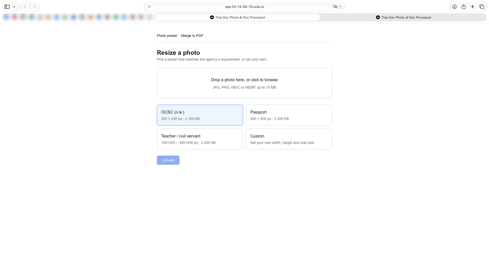
</p>

**สารบัญ:** [สถานะ](#สถานะโปรเจกต์) · [ปัญหาที่แก้](#ปัญหาที่แก้และฟีเจอร์) · [Architecture](#architecture) · [Branch flow & CI/CD](#branch-flow--cicd) · [Security](#security) · [Screenshots](#screenshots) · [โครงสร้าง repo](#โครงสร้าง-repo) · [เริ่มต้นใช้งาน](#เริ่มต้นใช้งาน) · [บทเรียน](#บทเรียนที่เจอจริง) · [เอกสาร](#เอกสารเพิ่มเติม)

---

## สถานะโปรเจกต์

| Phase | งาน | สถานะ |
| --- | --- | --- |
| 0 | App MVP: Go API, Next.js, Docker Compose | ✅ |
| 1 | Terraform: VPC, EC2, ECR, S3, IAM, remote state | ✅ |
| 2 | Cluster platform: K3s, cert-manager, Argo CD, Jenkins | ✅ |
| 3 | Kubernetes manifests (Kustomize): base + overlays | ✅ |
| 4 | Jenkins CI: lint, test, build, Trivy gate, push ECR | ✅ |
| 5 | Argo CD: auto sync, self-heal, smoke test, Discord | ✅ |
| 5+ | Flow สามชั้น `dev → staging → main`, build once promote | ✅ |
| 6 | Drift detect ทุกคืน, AWS Budgets, เอกสาร/screenshot | ✅ drift ทดสอบแจ้งเตือนแล้ว · Budgets เขียนเป็นโค้ดแต่ไม่ได้ apply ก่อนลบ |
| ปิดโปรเจกต์ | ลบ AWS ทั้งหมด (EC2, Elastic IP, VPC, ECR, S3, IAM, state bucket) ตรวจแล้วว่าไม่เหลืออะไร | ✅ |

รายละเอียดและผลทดสอบจริงของทุกข้อ: [docs/build-checklist.md](docs/build-checklist.md)

## ปัญหาที่แก้และฟีเจอร์

ระบบรับสมัครงานราชการกำหนดไฟล์เข้มงวดและต่างกันตามหน่วยงาน ผู้ใช้ย่อภาพผิดวิธีจนหน้าบิดเบี้ยวหรือเกิน KB แล้วถูกปฏิเสธ และเว็บแปลงไฟล์ฟรีหลายแห่งไม่ชัดเรื่อง PDPA ทั้งที่ไฟล์คือสำเนาบัตรประชาชน

| Preset | ขนาด | ไฟล์สูงสุด |
| --- | --- | --- |
| `ocsc` สำนักงาน ก.พ. | 200 × 230 px | 100 KB |
| `passport` หนังสือเดินทาง | 500 × 500 px | 200 KB |
| `teacher` ครู / ข้าราชการท้องถิ่น | 300 × 400 px | 200 KB |
| `custom` | กำหนดเอง | กำหนดเอง |

| ฝั่งผู้ใช้ | ฝั่ง DevOps |
| --- | --- |
| เลือก preset ระบบตั้งขนาด น้ำหนักไฟล์ให้ | Infrastructure ทั้งหมดเป็น Terraform (`apply` / `destroy` ได้ทั้งชุด) |
| บีบไฟล์ให้ต่ำกว่าเกณฑ์ KB ด้วย binary search หา JPEG quality | Build **ครั้งเดียว** บน `dev` แล้ว promote tag เดิมขึ้น staging และ prod |
| รวมรูป/PDF หลายไฟล์เป็น PDF เดียว (≤ 500 KB) | Trivy gate: ช่องโหว่ CRITICAL หยุด pipeline จริง |
| ต้นฉบับประมวลผลในหน่วยความจำ ไม่ถูกเก็บลง S3 เก็บเฉพาะผลลัพธ์ และหมดอายุเองใน 1 วัน | GitOps: Git คือแหล่งความจริงเดียว rollback ด้วย `git revert` |
| ไม่เก็บถาวร ไม่ log ชื่อ/เนื้อหาไฟล์ (PDPA) | Zero-downtime rolling update + smoke test หลัง deploy |

API: `GET /healthz` · `GET /api/v1/presets` · `GET /api/v1/selftest` · `POST /api/v1/photos/preset` · `POST /api/v1/documents/merge-pdf` ([docs/api-reference.md](docs/api-reference.md))

---

## Architecture

<p align="center">
  
</p>

| ชั้น | อะไร | หน้าที่ |
| --- | --- | --- |
| Application | Next.js 15 (Tailwind) + Go 1.24 / Gin / libvips (bimg) / pdfcpu + Amazon S3 (เก็บเฉพาะผลลัพธ์) | ประมวลผลไฟล์ ผู้ใช้เรียก `/api` แบบ same-origin ผ่าน Ingress เดียวกัน |
| Infrastructure | Terraform (state: S3 + lockfile) | VPC, EC2, Elastic IP, ECR, S3, IAM, Budgets ไม่แตะ application deployment |
| Platform | K3s + Traefik + cert-manager | cluster, ingress, TLS จาก Let's Encrypt |
| CI | Jenkins (Helm, agent เป็น pod ชั่วคราว) | lint, test, build (BuildKit rootless), scan (Trivy), push (crane) |
| CD | Argo CD (2 Applications) | อ่าน Git แล้ว sync เข้า cluster เอง (pull-based) |

| ส่วน | ค่าจริง |
| --- | --- |
| Region / network | `ap-southeast-1` · VPC `10.0.0.0/16` · public subnet `10.0.1.0/24` |
| EC2 | `m7i-flex.large` (2 vCPU / 8 GB) · Ubuntu 24.04 · EBS 35 GB เข้ารหัส · Elastic IP · IMDSv2 (hop limit 2 ให้ pod ใช้ IAM role ของเครื่อง) |
| Security group | 80/443 ทุกที่ · 6443 เฉพาะ IP ผู้ดูแล · **ไม่เปิด 22** (เข้าเครื่องผ่าน SSM) |
| Namespaces | `thai-gov` (prod) · `thai-gov-staging` · `jenkins` · `argocd` · `cert-manager` |
| ECR | `thai-gov-processor-backend` / `-frontend` · **IMMUTABLE** · scan on push · เก็บ 10 image ล่าสุด |
| S3 | bucket ไฟล์ผลลัพธ์ (block public access, SSE, lifecycle 1 วัน) · bucket เก็บ tfstate |
| Ingress | `app.` / `staging.` ไป frontend (`/`) และ backend (`/api`) · Jenkins เปิดสาธารณะเฉพาะ `/github-webhook/` |
| Jenkins / Argo CD UI | ไม่เปิดสาธารณะ เข้าผ่าน `kubectl port-forward` |

### ไฟล์ของผู้ใช้อยู่ที่ไหน: Amazon S3

บน cloud (prod และ staging) ใช้ **Amazon S3 จริง** MinIO เป็นแค่ตัวจำลอง S3 ใน `docker-compose` ตอนรันบนเครื่องตัวเอง

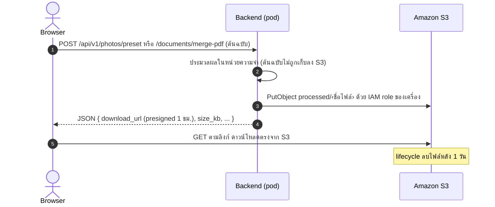

| เรื่อง | ค่าจริง |
| --- | --- |
| สิ่งที่เก็บใน S3 | เฉพาะ **ผลลัพธ์** ใน `processed/` (ต้นฉบับประมวลผลในหน่วยความจำของ backend ไม่ถูกบันทึก) |
| การป้องกัน bucket | block public access ทั้งหมด · เข้ารหัส SSE (AES256) · lifecycle ลบไฟล์หลัง 1 วัน + ลบ multipart ที่ค้าง |
| สิทธิ์ของ backend | IAM role ของเครื่อง: `s3:GetObject` และ `s3:PutObject` เฉพาะ bucket นี้ (ไม่มี `DeleteObject` ตั้งใจ ให้ lifecycle เป็นคนลบ) ไม่มี access key ใน Git หรือ cluster |
| ลิงก์ดาวน์โหลด | presigned URL อายุ 1 ชม. ชี้ไป `https://<bucket>.s3.ap-southeast-1.amazonaws.com/processed/…` |
| ข้อควรรู้ | S3 นับวันหมดอายุโดยปัดไปเที่ยงคืน UTC และลบแบบ asynchronous ไฟล์ผลลัพธ์จึงอาจค้างประมาณ 1–2 วัน ไม่ใช่ 24 ชม. เป๊ะ |

| | รันบนเครื่อง (`docker compose`) | cloud (prod / staging) |
| --- | --- | --- |
| Storage | MinIO (จำลอง S3 ไม่ต้องใช้บัญชี AWS) | Amazon S3 จริง |
| `S3_ENDPOINT` | ตั้ง (`http://minio:9000`) | **ไม่ตั้ง** = ใช้ AWS |
| Credential | static key (`minioadmin`) | IAM role ของ EC2 ผ่าน default credential chain |
| presigned URL ชี้ไป | `http://localhost:9000` (`S3_PUBLIC_ENDPOINT`) | host ของ S3 |
| Path style | `S3_FORCE_PATH_STYLE=true` | virtual-hosted |

โค้ดที่เลือกแบบนี้อยู่ที่ `backend/internal/storage/storage.go`: มี `S3_ENDPOINT` → ใช้ endpoint กำหนดเองกับ static credential, ไม่มี → ใช้ S3 จริงด้วย credential chain เดียวกับที่ AWS CLI ใช้

diagram แยกตาม tier และ sequence ของ request: [docs/architecture.md](docs/architecture.md)

---

## Branch flow & CI/CD

หลักคิดสามข้อ: **(1)** Jenkins ตรวจและแพ็ก แล้วเขียนเวอร์ชันลง Git ไม่มีสิทธิ์เข้า cluster **(2)** Argo CD อ่าน Git แล้ว deploy **(3)** image ถูก build และ scan **ครั้งเดียว** บน `dev` ส่วน staging และ prod แค่ย้าย tag เดียวกัน ของที่ขึ้น prod จึงเป็นของที่ผ่าน staging มาแล้วจริง

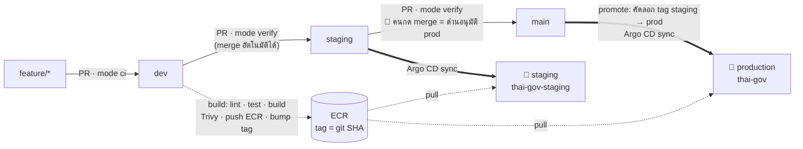

### Jenkinsfile เดียว ทำงาน 5 โหมด

`Classify` stage ตัดสินจาก branch / PR / commit ล่าสุด แล้วตั้ง `MODE` (เห็นในบรรทัดแรกของ console ทุก build)

| เหตุการณ์ | MODE | ทำอะไร | เวลา |
| --- | --- | --- | --- |
| PR จาก feature เข้า `dev` | `ci` | lint → test (`-race`) → build `.tar` → Trivy gate → terraform plan (ถ้าแก้ `iac/`) | ~10 นาที |
| PR `dev → staging`, `staging → main` | `verify` | ตรวจว่า image ของ tag ที่ promote มีใน ECR ทั้งสองตัว ไม่ build ใหม่ | < 1 นาที |
| PR ที่แก้แต่เอกสาร | `skip` | รายงานผ่านโดยไม่ build | วินาที |
| push เข้า `dev` | `build` | CI เต็ม → push `.tar` ที่ scan แล้วขึ้น ECR → bump tag ใน `overlays/staging` → Discord | ~10 นาที |
| push เข้า `staging` | `verify` | tag มากับ merge แล้ว แค่ตรวจ ECR | < 1 นาที |
| push เข้า `main` | `promote` | คัดลอก tag จาก staging ลง `overlays/prod` **เฉพาะเมื่อ merge นี้เปลี่ยน tag** → Discord | ~1 นาที |
| commit ของบอท `deploy … [skip ci]` | `skip` | ข้าม กันวนลูป | วินาที |

### Tag เดินทางอย่างไร (ตัวอย่างจริง `aeafc224`)

1. merge PR เข้า `dev` → Jenkins build, scan, push `backend:aeafc224` และ `frontend:aeafc224` ขึ้น ECR
2. Jenkins commit `deploy aeafc224 [skip ci]` แก้ `newTag` ใน `k8s/overlays/staging/kustomization.yaml` บน `dev`
3. PR `dev → staging` (verify) → merge → Argo CD sync **staging** → PostSync smoke test ผ่าน
4. PR `staging → main` (verify) → คนกด merge เป็นการอนุมัติ
5. `main` รัน `promote`: ตรวจ ECR → แก้ `overlays/prod` เป็น `aeafc224` → Argo CD sync **prod**
6. prod และ staging รัน image ตัวเดียวกัน: เทียบได้ด้วย `kubectl -n thai-gov get deploy -o wide` กับ `-n thai-gov-staging`

### กฎและด่านที่บังคับ

| ด่าน | วิธีบังคับ |
| --- | --- |
| ต้องผ่าน PR และเช็ค `continuous-integration/jenkins/pr-merge` | GitHub rulesets `protect-dev`, `protect-staging`, `protect-main` |
| merge ได้แบบ merge commit อย่างเดียว | ruleset `allowed_merge_methods: ["merge"]` (squash ทำให้ประวัติเพี้ยนและชนกันตอน promote) |
| PR เข้า `staging` ต้องมาจาก `dev` · PR เข้า `main` ต้องมาจาก `staging` | `Classify` ทำให้เช็คแดง → PR ถูก BLOCKED (ทดสอบแล้ว) |
| ช่องโหว่ CRITICAL ที่มีแพตช์ → ห้าม merge | Trivy: `fs` + `image --input` ของ `.tar` ตัวเดียวกับที่จะ push |
| ห้ามลบ / force push branch ที่สำคัญ | rulesets (บอท Jenkins push `deploy … [skip ci]` ผ่านสิทธิ์ bypass ของ admin) |
| image ที่ขึ้น production ต้องเป็นตัวที่สแกนแล้ว | push ไฟล์ `.tar` ตัวเดิมด้วย `crane` ไม่ build ซ้ำ · ECR IMMUTABLE |

### CD: Argo CD

| Application | ติดตาม | namespace | นโยบาย |
| --- | --- | --- | --- |
| `thai-gov` | `main` · `k8s/overlays/prod` | `thai-gov` | auto sync · prune · self-heal · backend HPA 2–4 pod ที่ CPU 70% |
| `thai-gov-staging` | `staging` · `k8s/overlays/staging` | `thai-gov-staging` | เหมือนกัน แต่ 1 replica ต่อ service ไม่มี HPA (เครื่องมี 2 vCPU) |

- **Rolling update** `maxSurge: 1`, `maxUnavailable: 0` + readinessProbe: pod ใหม่พร้อมก่อนถึงลบตัวเก่า
- **PostSync smoke test** (Job): เรียก `/healthz`, `/api/v1/selftest` และอัปโหลดรูปจริงเข้า `merge-pdf` ล้ม = sync ล้ม
- **Self-heal:** แก้ของใน cluster ด้วยมือ (`kubectl scale`) Argo ดึงกลับให้ตรง Git ภายในไม่กี่วินาที (ทดสอบแล้ว)
- **Rollback = `git revert`** ที่ commit แก้ tag (ใส่ `[skip ci]` ไม่งั้น Jenkins build ใหม่แล้วเดินหน้าทับ) Argo sync กลับเอง (ทดสอบแล้ว: `dade6694 → 4c026658` และกลับ) · Argo ตรวจ Git ทุก ~3 นาที สั่งเร็วได้ด้วย annotation `argocd.argoproj.io/refresh=hard`
- **Discord:** Jenkins (push/promote/ล้ม) + Argo CD (`deployed`, `sync failed` ส่งครั้งเดียวต่อ revision ด้วย `oncePer`) + drift

### Infrastructure drift

Jenkins job `terraform-drift` รันทุกคืน **02:00 เวลาไทย** (`TZ=Asia/Bangkok`): `terraform plan -detailed-exitcode` ด้วย user `tf-readonly` exit 0 = สะอาด · exit 2 = มีคนแก้ AWS ด้วยมือหรือโค้ดยังไม่ถูก apply → build เป็น UNSTABLE + Discord ⚠️ · exit 1 = ตัวตรวจพัง → ล้ม + Discord ❌ AWS Budgets เตือนที่ 80% ของงบ ($10) และเมื่อ forecast เกิน 100%

รายละเอียดทุกขั้น พร้อม diagram: [docs/cicd-pipeline.md](docs/cicd-pipeline.md)

---

## Security

| ชั้น | สิ่งที่ทำ |
| --- | --- |
| Git | rulesets 3 branch · required check · merge-commit only · source-branch guard |
| Supply chain | Trivy สแกนซอร์ส, secret, image · scan ตัวเดียวกับที่ push · ECR IMMUTABLE + scan on push · pin เวอร์ชัน image ของ CI ทุกตัว |
| Secrets | ไม่มี access key ใน Git/cluster: ECR และ S3 ใช้ IAM role ของเครื่อง · token อื่นอยู่ใน k8s Secret → Jenkins Credentials (JCasC) |
| Container | non-root · `readOnlyRootFilesystem` · drop capabilities ทั้งหมด · seccomp `RuntimeDefault` · resource limits |
| CI | agent เป็น pod ชั่วคราว (`numExecutors: 0` บน controller) · BuildKit rootless ไม่ใช้ Docker socket · Jenkins ไม่มีสิทธิ์ใน cluster |
| Network / Host | เปิดแค่ 80/443 · K3s API เฉพาะ IP ผู้ดูแล · ไม่มี SSH (SSM) · IMDSv2 · EBS เข้ารหัส · Jenkins UI และ Argo CD UI ไม่เปิดสาธารณะ |
| Data (PDPA) | ไม่เก็บต้นฉบับลง S3 (ประมวลผลในหน่วยความจำ) · ผลลัพธ์ใน S3: block public access + SSE + lifecycle 1 วัน · presigned URL 1 ชม. · ลบ EXIF · ไม่ log เนื้อหาไฟล์ |
| Terraform | CI ใช้ user `tf-readonly` (อ่านอย่างเดียว) · drift detect ทุกคืน |

รายละเอียดและตารางสิทธิ์: [docs/security.md](docs/security.md)

---

## Screenshots

### แอป: production และ staging รัน image เดียวกัน
| Production | Staging |
| --- | --- |
|  | 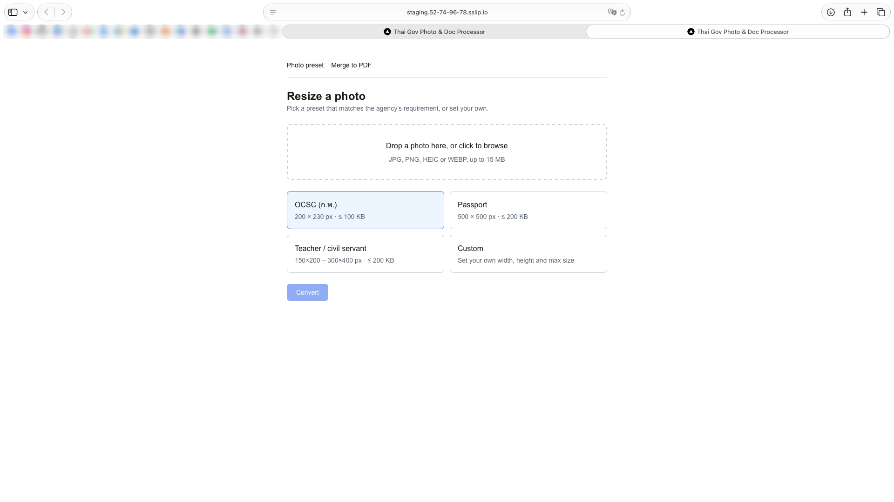 |

### CI: Jenkins
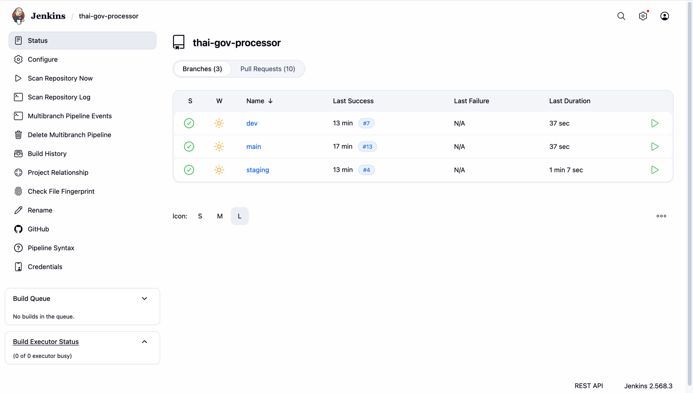

*Multibranch pipeline เห็น 3 branch (`dev`, `main`, `staging`) กับ PR ทั้งหมด สีเขียวทุกตัว*

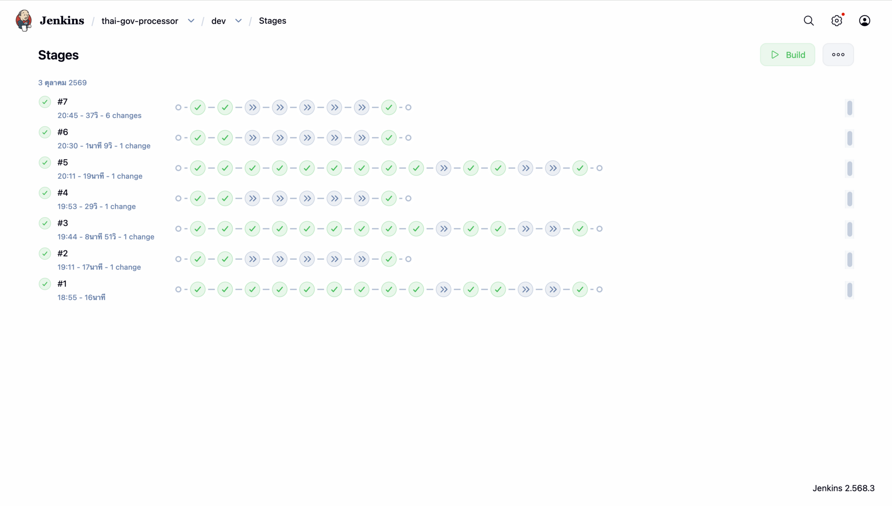

*Pipeline Graph View ของ `dev`: run #1, #3, #5 คือ `build` เต็ม (CI → push ECR → bump tag) ส่วน #2, #4, #6, #7 คือ commit ของบอทที่ถูกข้ามอย่างถูกต้อง (ลูกศรเทา)*

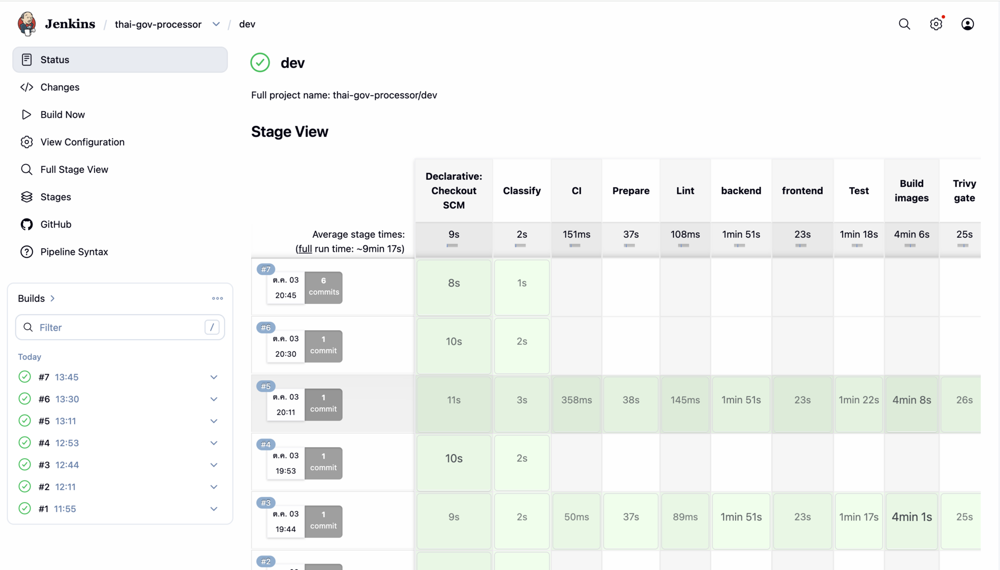

*Stage View: เวลาแต่ละ stage เฉลี่ยทั้ง run ~9 นาที 17 วินาที (Build images ~4 นาที เป็นส่วนที่ช้าที่สุดบนเครื่อง 2 vCPU)*

### Git flow
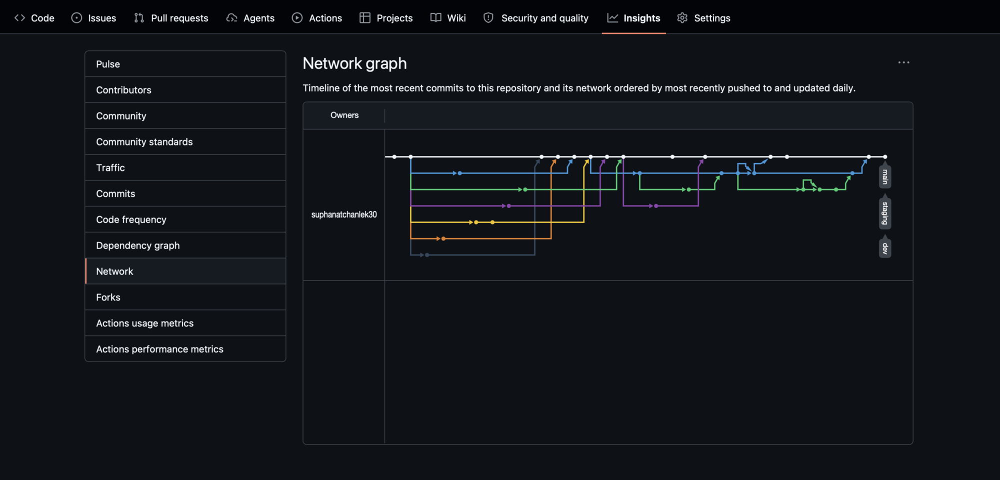

*Network graph: feature branch แตกจาก `dev`/`main`, merge กลับผ่าน PR, และเส้น `dev → staging → main`*

| PR `dev → staging` (#47) | PR `staging → main` (#48) |
| --- | --- |
| 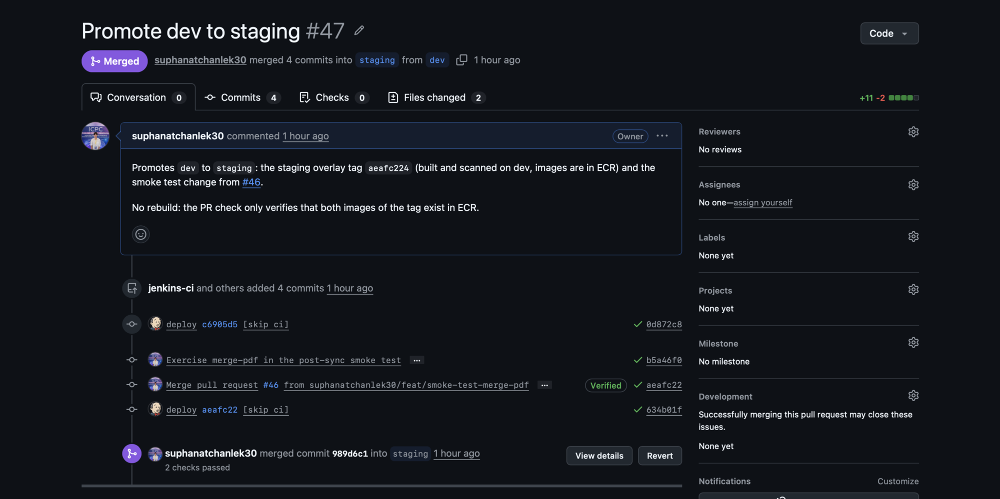 | 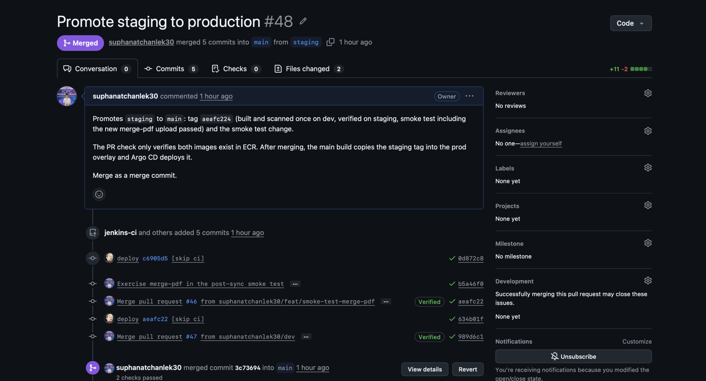 |

*PR promote ใช้ merge commit และมี commit `deploy aeafc224 [skip ci]` ของ `jenkins-ci` ติดมาด้วย คือ tag ที่ build ครั้งเดียวบน `dev`*

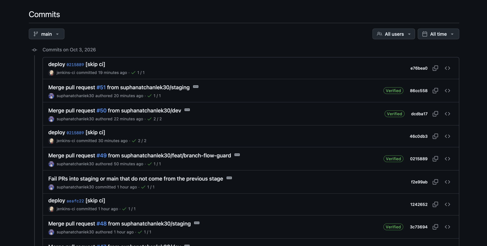

*ประวัติ `main`: merge ของคนสลับกับ `deploy <tag> [skip ci]` ของ `jenkins-ci` = ทุก deploy ตรวจย้อนหลังได้จาก `git log`*

### CD: Argo CD
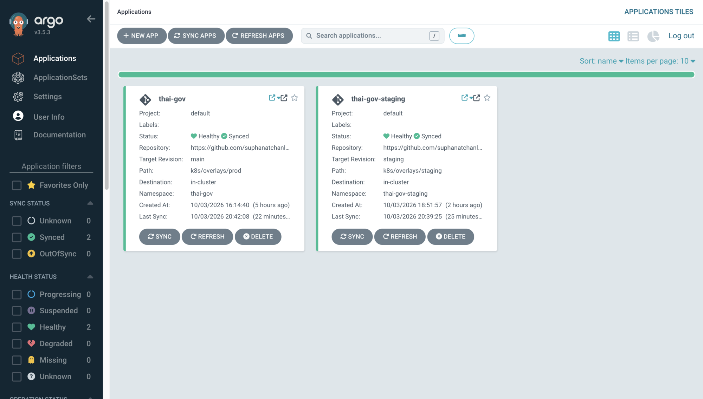

*สอง Application: `thai-gov` (`main` → prod) และ `thai-gov-staging` (`staging`) ทั้งคู่ Healthy + Synced*

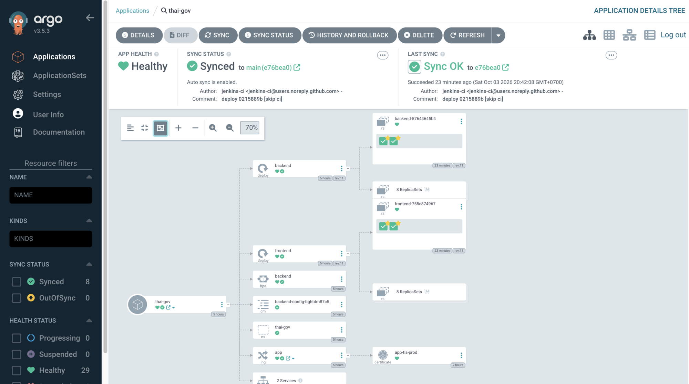

*Resource tree ของ prod: deploy → ReplicaSet → pod, HPA, ConfigMap, Ingress และ Certificate (`app-tls-prod` จาก Let's Encrypt)*

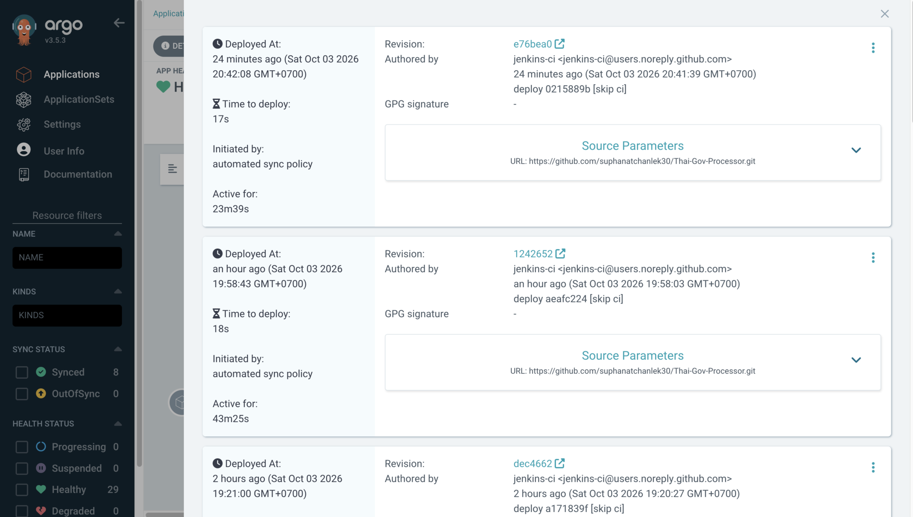

*History and rollback: ทุก revision ที่ sync ("Initiated by: automated sync policy") พร้อมเวลา deploy 17–18 วินาที*

### แจ้งเตือน
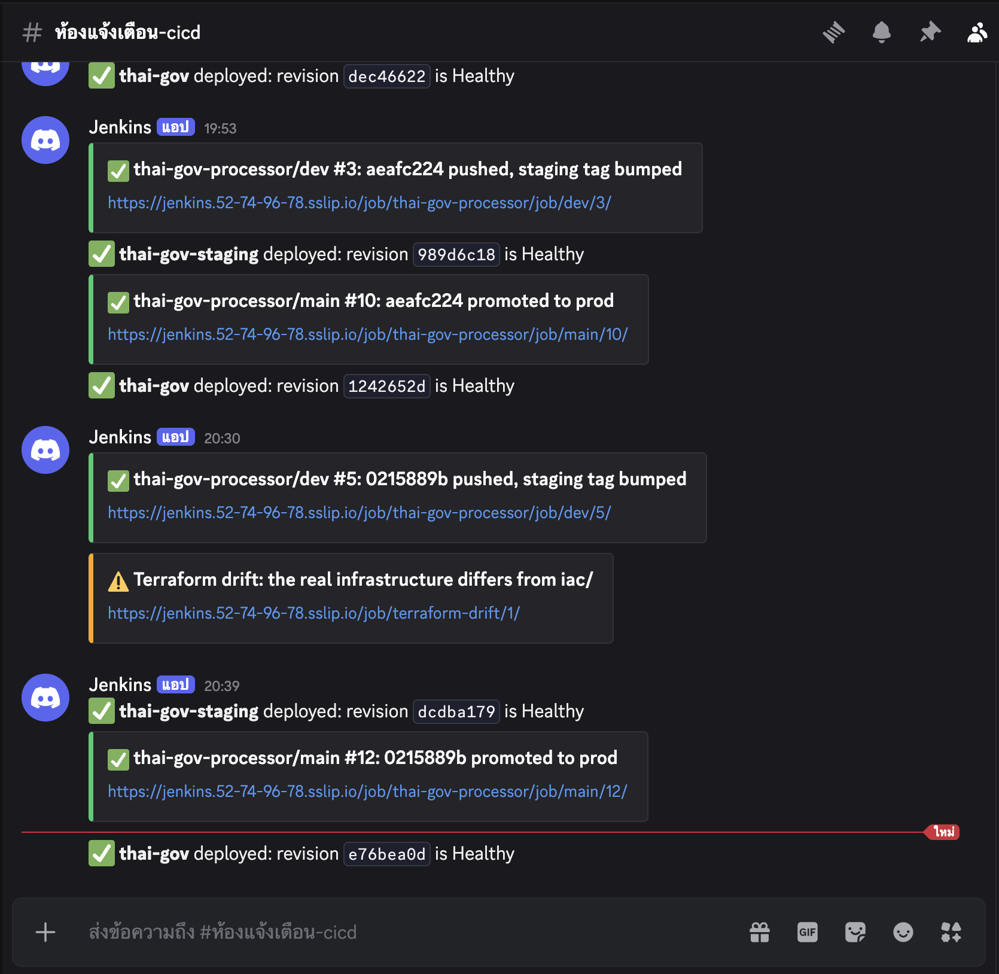

*Discord: Argo CD แจ้ง `deployed … is Healthy`, Jenkins แจ้ง `pushed, staging tag bumped` และ `promoted to prod`, และ ⚠️ drift จาก job ทุกคืน*

---

## โครงสร้าง repo

```text
.
├── backend/                      # Go + Gin
│   ├── cmd/api/main.go           # entry point, router, graceful shutdown
│   └── internal/
│       ├── handler/              # health, presets, photos, merge_pdf, selftest
│       ├── service/{photo,document}/   # bimg/libvips resize+compress · pdfcpu merge
│       ├── preset/  storage/  middleware/  apierr/
│       └── ...                   # มี unit test ใน handler, photo, document
├── frontend/                     # Next.js 15 (standalone build)
│   └── src/{app,components,lib}  # preset selector, drop zone, merge-pdf page
├── iac/                          # Terraform
│   ├── network.tf  security_group.tf  ec2.tf  iam.tf  ecr.tf  s3.tf
│   ├── ci_iam.tf                 # user tf-readonly (CI plan + drift)
│   ├── budget.tf                 # AWS Budgets
│   └── templates/user_data.sh.tftpl   # ติดตั้ง K3s + ecr-credential-provider
├── k8s/
│   ├── base/                     # deployment, service, HPA, smoke-test Job
│   ├── overlays/{prod,staging}/  # namespace, ingress, image tag ← Jenkins แก้ที่นี่
│   └── platform/                 # argocd-application(.staging), argocd-notifications,
│                                 #   cluster-issuer, jenkins-values (JCasC)
├── ci/
│   ├── agent-pod.yaml            # agent pod 9 container (tools, golang, node, buildkit, trivy, terraform, aws-cli, crane)
│   ├── drift.Jenkinsfile         # terraform drift ทุกคืน
│   └── git-askpass.sh
├── scripts/
│   ├── create-ci-secrets.sh      # สร้าง k8s Secret ที่ Jenkins ใช้
│   └── bootstrap-cluster.sh      # cert-manager, Argo CD (+ notifications, 2 apps), Jenkins
├── Jenkinsfile                   # pipeline หลัก 5 โหมด
├── docker-compose.yml            # frontend + backend + MinIO
├── Architecture diagram/         # draw.io / svg
└── docs/                         # เอกสาร + screenshots/
```

---

## เริ่มต้นใช้งาน

### รันบนเครื่อง (ไม่ต้องใช้ AWS)
```bash
docker compose up --build
# frontend  http://localhost:3000
# backend   http://localhost:8080/healthz
# MinIO     http://localhost:9001   (minioadmin / minioadmin) ใช้จำลอง S3 เฉพาะบนเครื่อง
```
บน cloud ใช้ Amazon S3 จริง ดู [ไฟล์ของผู้ใช้อยู่ที่ไหน](#ไฟล์ของผู้ใช้อยู่ที่ไหน-amazon-s3) ถ้าอยากลอง S3 จริงจากเครื่อง (ตามโค้ดใน `storage.go` ยังไม่ได้ทดสอบ): ไม่ตั้ง `S3_ENDPOINT` และ `S3_ACCESS_KEY` แล้วรัน `cd backend && S3_BUCKET=<bucket ทดสอบ> S3_REGION=ap-southeast-1 AWS_PROFILE=<profile> go run ./cmd/api` (ใช้ bucket แยกจาก production)
- backend: `cd backend && go test -race ./...` (ต้องมี `libvips-dev` และ `pkg-config` เพราะ bimg ใช้ cgo)
- frontend: `cd frontend && npm ci && npm run dev` (ไม่ตั้ง `NEXT_PUBLIC_API_BASE_URL` = ใช้ `http://localhost:8080`; ตั้งเป็นค่าว่างบน cluster = เรียก `/api` แบบ same-origin)

### Deploy ขึ้น AWS (ย่อ)
1. สร้าง S3 bucket สำหรับ Terraform state ด้วยมือ (เปิด versioning) ครั้งเดียว
2. `cp iac/terraform.tfvars.example iac/terraform.tfvars` ใส่ `admin_cidr` (IP ตัวเอง `/32`) และ `budget_alert_email` → `terraform init && terraform plan && terraform apply`
3. ดึง kubeconfig ผ่าน SSM (`/etc/rancher/k3s/k3s.yaml` แทน `127.0.0.1` ด้วย Elastic IP) เก็บเป็น `~/.kube/thai-gov-k3s.yaml` แล้ว `export KUBECONFIG=...`
4. `./scripts/create-ci-secrets.sh` (ต้องตั้ง `GITHUB_TOKEN`, `DISCORD_WEBHOOK_URL`, `TF_READONLY_KEY_ID/SECRET`) แล้ว `./scripts/bootstrap-cluster.sh`
5. GitHub: webhook (`/github-webhook/` + secret จาก k8s Secret), สร้าง branch `dev` และ `staging` จาก `main`, สร้าง rulesets ของ 3 branch

ทีละขั้นพร้อมค่าที่ต้องใช้: [docs/getting-started.md](docs/getting-started.md) · ลำดับการสร้างทั้งระบบ: [docs/build-checklist.md](docs/build-checklist.md)

### คู่มือใช้งานประจำวัน

| อยากทำ | ทำอย่างไร |
| --- | --- |
| ดู Jenkins / Argo CD | `kubectl -n jenkins port-forward svc/jenkins 18080:8080` · `kubectl -n argocd port-forward svc/argocd-server 8081:443` |
| ส่งโค้ดขึ้น prod | PR เข้า `dev` → PR `dev → staging` → PR `staging → main` (กด merge เป็นการอนุมัติ) |
| hotfix | ไปทางเดียวกันเสมอ guard ไม่ให้ข้ามชั้น |
| rollback prod | `git revert` commit `deploy <tag>` ล่าสุดบน `main` ใส่ `[skip ci]` ใน message แล้ว push (ต้องใช้สิทธิ์ admin bypass) → Argo sync กลับ |
| ตรวจ drift ตอนนี้ | Jenkins → `terraform-drift` → Build Now |
| ประหยัดค่าใช้จ่าย | `terraform destroy -target=aws_instance.app` (เก็บ Elastic IP, ECR, state ไว้) |
| สร้าง cluster คืน | `terraform apply` → kubeconfig ผ่าน SSM → `create-ci-secrets.sh` → `bootstrap-cluster.sh` → อัปเดต webhook secret ของ GitHub |

---

## ข้อจำกัดและ Roadmap

| ข้อจำกัดที่รู้อยู่แล้ว | ผล | ถ้าจะแก้ |
| --- | --- | --- |
| Single node | เครื่องล่ม = เว็บล่ม | EKS หรือ K3s หลาย node + ALB |
| ทุก pod ใช้ IAM role ของเครื่องร่วมกัน | pod ใดก็ใช้สิทธิ์ ECR/S3 ได้ | Pod Identity / IRSA |
| Build ช้า (~9–10 นาที/รอบ) | เครื่อง 2 vCPU, agent สร้างใหม่ทุก build ไม่มี cache | agent image สำเร็จรูป, BuildKit cache, เครื่อง build แยก |
| รัน build ได้ทีละตัว (`containerCap: 1`) | build ซ้อนกันเคยทำดิสก์เต็ม → pod ถูก evict | เครื่อง build แยก |
| merge เอกสารเข้า `dev` ยังรัน build เต็ม | ข้ามได้เฉพาะระดับ PR (กัน Jenkins รวมหลาย merge แล้วซ่อนโค้ด) | เทียบกับ revision ที่ build ล่าสุด |
| ECR เก็บ 10 image ล่าสุด | prod ที่ตามหลัง staging เกิน 10 build อาจดึง image ไม่ได้ | เพิ่ม lifecycle count |
| Rollback ต้องมีคน `git revert` | ไม่อัตโนมัติ | Argo Rollouts + analysis |
| Jenkins เปิด `/github-webhook/` สู่ internet | เป็นเป้าโจมตี | จำกัด IP ของ GitHub หรือใช้ relay |

**Roadmap:** observability (Prometheus + Grafana แบบเบา) · Argo Rollouts (canary) · ลงนาม image ด้วย cosign · Kyverno (บังคับ non-root, ห้าม tag `latest`) · load test k6 ดู HPA ขยายจริง

---

## บทเรียนที่เจอจริง

| ปัญหา | สาเหตุ | แก้อย่างไร |
| --- | --- | --- |
| `merge-pdf` ทำ API ตาย (502/503) บน cluster ทั้งที่ `/healthz` เขียว | pdfcpu เขียน config ลง `$HOME` แล้ว `os.Exit(1)` เมื่อ filesystem เป็น read-only | `api.DisableConfigDir()` + smoke test อัปโหลดไฟล์จริงเข้า `merge-pdf` (Docker Compose เขียนไฟล์ได้ จึงไม่เคยเจอ) |
| build วนซ้ำเมื่อ merge หลาย PR ติดกัน | `scmSkip` อ่าน commit จาก changelog ไม่ใช่ commit บนสุด | อ่าน `git log -1` เอง ไม่ใช้กับ PR |
| node ดิสก์เต็ม pod ถูก evict กลางคัน | build สองตัวรันพร้อมกันบน 2 vCPU | `containerCap: 1` |
| HPA กับ self-heal แย่งกันตั้ง `replicas` | Deployment ระบุ `replicas` คู่กับ HPA | เอา `replicas` ออกให้ HPA คุม |
| `git revert` แล้วไม่มีอะไรเกิดขึ้น | revert กลับเร็วกว่ารอบ poll ของ Argo (3 นาที) | รอ หรือ `refresh=hard` |
| prod ได้ URL ของ staging ติดมากับ image | `NEXT_PUBLIC_API_BASE_URL` ฝังตอน build | frontend เรียก `/api` แบบ same-origin → image เดียวใช้ทุก environment |
| เช็ค "แก้แต่เอกสาร" ให้ผลผิดบน Mac แต่ถูกบน container | `grep -q -v` ต่างกันตาม implementation | นับบรรทัดด้วย `grep -vc` |
| pod `ImagePullBackOff` หลัง 12 ชม. | token ECR หมดอายุ | `ecr-credential-provider` ใช้ IAM role ของเครื่อง |

---

## เอกสารเพิ่มเติม

| เอกสาร | เนื้อหา |
| --- | --- |
| [docs/architecture.md](docs/architecture.md) | diagram แยก tier, runtime บน AWS, sequence ของ request |
| [docs/cicd-pipeline.md](docs/cicd-pipeline.md) | flow สามชั้น, Jenkins 5 โหมด, GitOps, rollback, drift |
| [docs/infrastructure.md](docs/infrastructure.md) | Terraform: ไฟล์, workflow, state bucket, Budgets |
| [docs/getting-started.md](docs/getting-started.md) | ขั้นตอน deploy ตั้งแต่ศูนย์ |
| [docs/build-checklist.md](docs/build-checklist.md) | Checklist Phase 0–6 พร้อมผลทดสอบจริง |
| [docs/tech-stack.md](docs/tech-stack.md) | เหตุผลเลือกแต่ละเครื่องมือ และทางเลือกที่ไม่เลือก |
| [docs/security.md](docs/security.md) | สิทธิ์การเข้าถึง, security control, PDPA |
| [docs/api-reference.md](docs/api-reference.md) · [docs/compression-algorithm.md](docs/compression-algorithm.md) | REST API · อัลกอริทึมหา JPEG quality |
| [docs/cost.md](docs/cost.md) | ค่าใช้จ่ายและวิธีคุมงบ |
| [docs/roadmap.md](docs/roadmap.md) · [docs/lessons-learned.md](docs/lessons-learned.md) | ข้อจำกัด/สิ่งที่จะทำต่อ · ปัญหาและหลักฐานการทำงาน |

---

## License

MIT
