# 🇹🇭 Thai Gov Photo & Doc Processor

> เว็บแปลงรูปถ่ายและเอกสารให้ตรงสเปกระบบรับสมัครของหน่วยงานราชการไทยโดยอัตโนมัติ พร้อม production-like DevOps workflow ตั้งแต่ Terraform → AWS → K3s → Jenkins CI → Trivy → ECR → Argo CD GitOps → Production


โปรเจกต์นี้ทำขึ้นเพื่อเรียนรู้ DevOps แบบครบวงจร ตั้งแต่ Infrastructure as Code, container, Kubernetes, CI/CD, security scanning ไปจนถึง GitOps โดยใช้เว็บแปลงรูป/เอกสารเป็น workload จริงสำหรับทดสอบ pipeline ไม่ใช่จุดขายหลักของโปรเจกต์

> ระบบนี้เป็น production-like บน EC2 เครื่องเดียว ไม่ได้ออกแบบมาเพื่อ high availability — ข้อจำกัดและแนวทางต่อยอดอยู่ที่ [docs/roadmap.md](docs/roadmap.md)

---

## ปัญหาที่แก้

ระบบรับสมัครงานราชการ รัฐวิสาหกิจ และงานทะเบียนในไทย มีข้อกำหนดเรื่องไฟล์ที่เข้มงวดและแตกต่างกันในแต่ละหน่วยงาน:

| หน่วยงาน / วัตถุประสงค์ | ขนาดภาพ | ประเภท | ขนาดไฟล์สูงสุด | เงื่อนไขพิเศษ |
| :--- | :--- | :--- | :--- | :--- |
| สำนักงาน ก.พ. (OCSC) | 200 × 230 px (1 × 1.5 นิ้ว) | `.jpg` | 100 KB (บางรอบ 50–100 KB) | หน้าตรง สัดส่วนต้องไม่บิดเบี้ยว |
| หนังสือเดินทาง | 500 × 500 px (2 × 2 นิ้ว) | `.jpg` | 200 KB | ฉากหลังขาวล้วน |
| ครูผู้ช่วย / ข้าราชการท้องถิ่น | 150 × 200 ถึง 300 × 400 px | `.jpg` | 200 KB | หน้าตรง เครื่องแต่งกายสุภาพ |
| สำเนาเอกสาร (บัตร ปชช. / ทะเบียนบ้าน) | A4 หลายหน้า | `.pdf` | รวม 500 KB | อ่านเลขบัตรได้ชัด |

ข้อกำหนดจริงเปลี่ยนตามประกาศแต่ละรอบ ค่าในตารางใช้เป็น preset เริ่มต้น ผู้ใช้เลือกแบบ `custom` ได้เอง

ปัญหาที่พบบ่อย: ผู้ใช้ทั่วไปไม่มีเครื่องมือกำหนดขนาดไฟล์เป็น KB ได้แม่นยำ ย่อภาพผิดวิธีจนหน้าบิดเบี้ยวแล้วระบบปฏิเสธไฟล์ และเว็บแปลงไฟล์ฟรีหลายแห่งไม่มีนโยบายความเป็นส่วนตัวชัดเจน ซึ่งเสี่ยงมากเมื่อไฟล์คือสำเนาบัตรประชาชน (PDPA)

## ฟีเจอร์

| ฝั่งผู้ใช้ | ฝั่ง DevOps |
| --- | --- |
| เลือก preset ตามหน่วยงาน ระบบตั้งขนาด น้ำหนักไฟล์ และสีฉากหลังให้ | Infrastructure ทั้งหมดสร้างด้วย Terraform (`apply` / `destroy` ได้ในคำสั่งเดียว) |
| Crop และหมุนภาพ โดยล็อกสัดส่วนตาม preset | Jenkins agent เป็น pod ชั่วคราว สร้างตอน build แล้วลบทิ้ง |
| บีบไฟล์ให้ต่ำกว่าเกณฑ์ KB โดยรักษาความคมชัดสูงสุด | Security gate ด้วย Trivy: เจอช่องโหว่ CRITICAL จะหยุด pipeline จริง |
| รวมหลายไฟล์ (รูปภาพ และ/หรือ PDF หลายไฟล์) เป็น PDF เดียวที่ไม่เกิน 500 KB | GitOps ด้วย Argo CD: Git คือแหล่งความจริงเดียว rollback ได้ด้วย `git revert` |
| เทียบขนาดก่อนและหลัง เช่น 3.4 MB → 89 KB | Zero-downtime rolling update พร้อม smoke test หลัง deploy |
| ไฟล์หมดอายุอัตโนมัติ ไม่เก็บถาวร | ไม่มี access key ใน Git ใช้ IAM role ทั้งหมด และเข้าเครื่องผ่าน SSM แทน SSH |

---

## Architecture

<p align="center">
  
</p>

Jenkins ทำหน้าที่ตรวจและแพ็กโค้ด (CI) แล้วเขียนเวอร์ชันใหม่ลง Git จากนั้น Argo CD อ่าน Git แล้วเอาขึ้น production จริง (CD) ส่วน Terraform เป็นคนสร้างเครื่องและบริการบน AWS ทั้งหมด Jenkins จึงไม่มีสิทธิ์ deploy เข้า production โดยตรง

Diagram แยกตาม tier, runtime บน AWS และ sequence ของ request หนึ่งครั้งอยู่ที่ [docs/architecture.md](docs/architecture.md)

## CI/CD Pipeline

นี่คือแกนของโปรเจกต์นี้ ทุกอย่างที่ขึ้น production ต้องผ่าน pipeline นี้ ไม่มีการ SSH เข้าเครื่องแล้วแก้ไฟล์ตรงๆ

```mermaid
flowchart TB
    subgraph L1["① Developer & GitHub"]
        direction LR
        a1["สร้าง branch<br/>feat/*"] --> a2["commit & push"] --> a3["เปิด Pull Request<br/>(branch protection)"] --> a4["GitHub webhook<br/>ลงนามด้วย HMAC secret"]
    end

    subgraph L2["② CI · PR pipeline (ตรวจอย่างเดียว ไม่ deploy)"]
        direction LR
        b1["Checkout"] --> b2["Lint"] --> b3["Unit test"] --> b4["Build image<br/>(ยังไม่ push)"] --> b5{{"🛡️ Trivy gate<br/>CRITICAL = fail"}} --> b6["Terraform plan<br/>(ถ้าแก้ iac/)"] --> b7["ส่งสถานะ ✔/✘<br/>กลับไปที่ PR"]
    end

    subgraph L3["③ CI · main pipeline (build ของจริง)"]
        direction LR
        c1["Build image<br/>tag = git SHA"] --> c2{{"🛡️ Trivy gate<br/>สแกนซ้ำ"}} --> c3["Push ECR"] --> c4["แก้ tag ใน<br/>kustomization.yaml"] --> c5["แจ้ง Discord"]
    end

    subgraph L4["④ CD · Argo CD (GitOps)"]
        direction LR
        d1["ตรวจเจอ commit ใหม่"] --> d2["Sync เข้า<br/>ns: production"] --> d3["Rolling update"] --> d4{{"🧪 Smoke test<br/>PostSync Job"}} --> d5["✅ แจ้งผล / ❌ git revert"]
    end

    a4 --> b1
    b7 --> rv["👀 Code review + Merge"]
    rv --> c1
    c5 --> d1

    classDef gate fill:#fde4e4,stroke:#b83030,color:#5c1414
    classDef pr fill:#e8ebff,stroke:#3f4fc2,color:#1b2270
    classDef main fill:#dff3f4,stroke:#0a7580,color:#053b40
    classDef cd fill:#e3f4e8,stroke:#2b7f43,color:#14401f
    class b1,b2,b3,b4,b6,b7 pr
    class c1,c3,c4,c5 main
    class d1,d2,d3,d5 cd
    class b5,c2,d4 gate
```



กล่องหกเหลี่ยมสีแดงคือด่านตรวจ (Trivy, smoke test) — ไม่ผ่านคือ pipeline หยุดตรงนั้น ไม่ใช่แค่แจ้งเตือนแล้วรันต่อ

Build image ทำครั้งเดียว push ไฟล์ที่ผ่าน scan แล้วไปตรงๆ ไม่ build ซ้ำตอน push เพื่อกัน image ที่ขึ้น production เป็นคนละตัวกับที่สแกนผ่าน และ Argo CD ไม่ rollback ให้เองเมื่อ smoke test ไม่ผ่าน — ต้อง `git revert` แล้วปล่อยให้ Argo CD sync กลับ

Sequence diagram ของการ deploy, ประวัติ Git จริง และตาราง event → action แบบละเอียดอยู่ที่ [docs/cicd-pipeline.md](docs/cicd-pipeline.md)

---

## Repository structure

```text
thai-gov-processor/
├── backend/                         # Go + Gin API
│   ├── cmd/api/main.go              # entry point, Gin router, graceful shutdown
│   ├── internal/
│   │   ├── handler/                 # Gin handlers (preset, merge-pdf, health, selftest)
│   │   ├── processor/               # resize + binary search compress, pdfcpu
│   │   ├── storage/                 # S3 client + presigned URL
│   │   └── preset/                  # ค่า preset ก.พ., passport, ครู
│   ├── Dockerfile
│   └── go.mod / go.sum
├── frontend/                        # Next.js 14
│   ├── src/app/
│   ├── src/components/              # DropZone, PresetCard, ImageCropper, PreviewModal
│   ├── Dockerfile
│   └── package.json
├── iac/                             # Terraform — ดู docs/infrastructure.md
├── k8s/
│   ├── base/                        # deployment, service, hpa, ingress, smoke-test job
│   ├── overlays/prod/kustomization.yaml   # ← Jenkins แก้ image tag ที่ไฟล์นี้
│   ├── argocd/application.yaml
│   └── platform/                    # jenkins-values.yaml, cluster-issuer.yaml, credential-provider.yaml
├── ci/
│   ├── agent-pod.yaml               # spec ของ Jenkins agent pod
│   └── Jenkinsfile.drift            # job drift detect ทุกคืน
├── scripts/bootstrap-cluster.sh     # ติดตั้ง cert-manager, Argo CD, Jenkins
├── docker-compose.yml
├── Jenkinsfile                      # pipeline หลัก (PR + main)
├── docs/                            # เอกสารรายละเอียด — ดูสารบัญด้านล่าง
└── README.md
```

## เอกสารเพิ่มเติม

| เอกสาร | เนื้อหา |
| --- | --- |
| [docs/architecture.md](docs/architecture.md) | Diagram แยกตาม tier, runtime บน AWS, sequence ของ request |
| [docs/cicd-pipeline.md](docs/cicd-pipeline.md) | CI/CD แบบลึก — sequence diagram, GitOps, git history, ตาราง event |
| [docs/infrastructure.md](docs/infrastructure.md) | Terraform: โครงสร้างไฟล์, workflow, state bucket |
| [docs/tech-stack.md](docs/tech-stack.md) | เหตุผลเลือกเทคโนโลยีแต่ละตัวและทางเลือกที่ไม่เลือก |
| [docs/getting-started.md](docs/getting-started.md) | ขั้นตอนเริ่มใช้งานทีละสเต็ป |
| [docs/build-checklist.md](docs/build-checklist.md) | Checklist สร้างระบบทั้งหมด แบ่งเป็น Phase 0–6 |
| [docs/api-reference.md](docs/api-reference.md) | REST API ของ backend |
| [docs/compression-algorithm.md](docs/compression-algorithm.md) | อัลกอริทึมหา JPEG quality ด้วย binary search |
| [docs/security.md](docs/security.md) | สิทธิ์การเข้าถึง, security control แต่ละชั้น, PDPA |
| [docs/cost.md](docs/cost.md) | ประมาณการค่าใช้จ่ายและวิธีคุมงบ |
| [docs/roadmap.md](docs/roadmap.md) | ข้อจำกัดที่รู้อยู่แล้วและสิ่งที่จะทำต่อ |
| [docs/lessons-learned.md](docs/lessons-learned.md) | หลักฐานการทำงานและปัญหาที่เจอระหว่างทำ |

## เริ่มต้นใช้งาน

รันบนเครื่องตัวเองด้วย Docker Compose ก่อนได้เลยโดยไม่ต้องแตะ AWS ส่วนขั้นตอนตั้งแต่สร้าง infrastructure จนถึง deploy ครั้งแรกอยู่ที่ [docs/getting-started.md](docs/getting-started.md) และลำดับการสร้างระบบทั้งหมดอยู่ที่ [docs/build-checklist.md](docs/build-checklist.md)

---

## License

MIT
