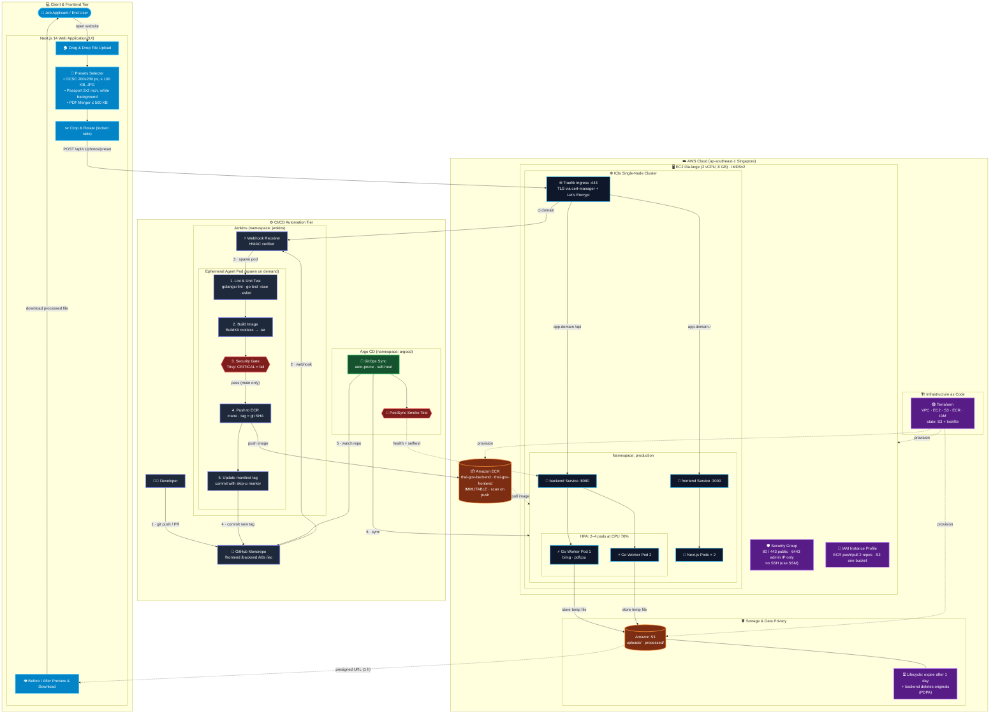
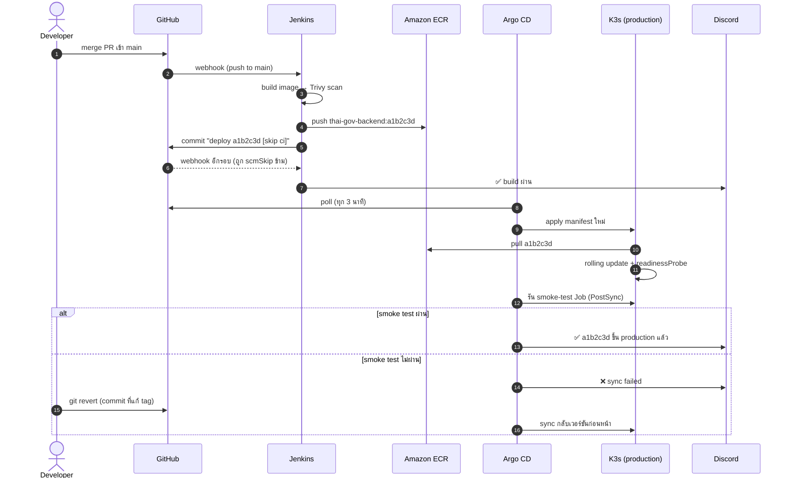
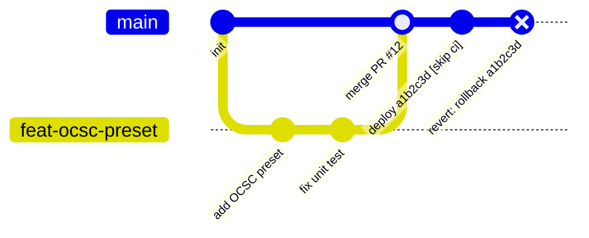
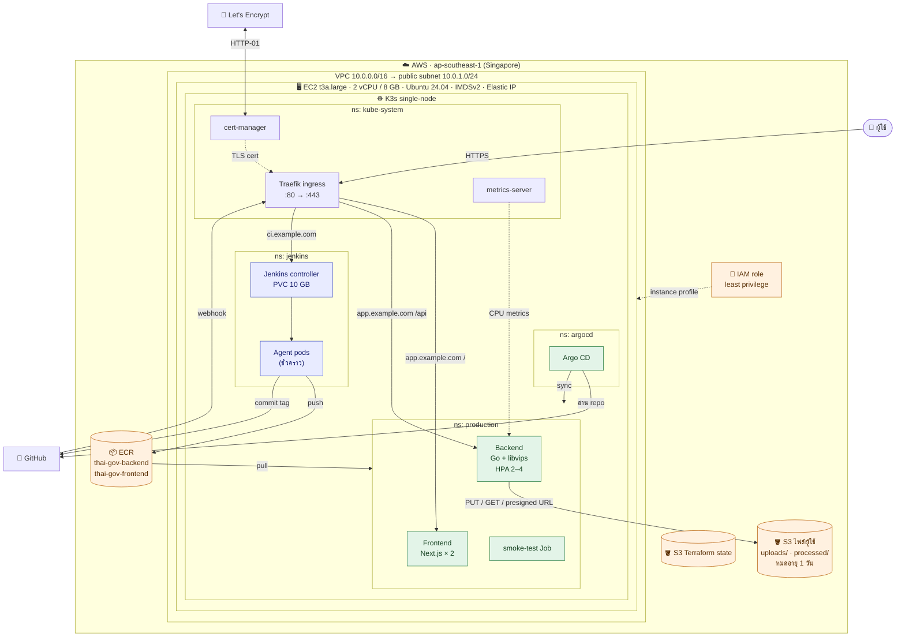
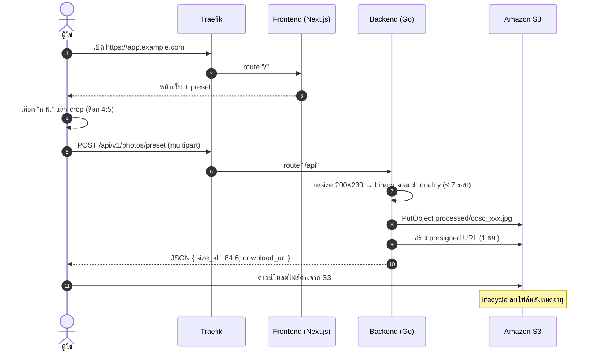
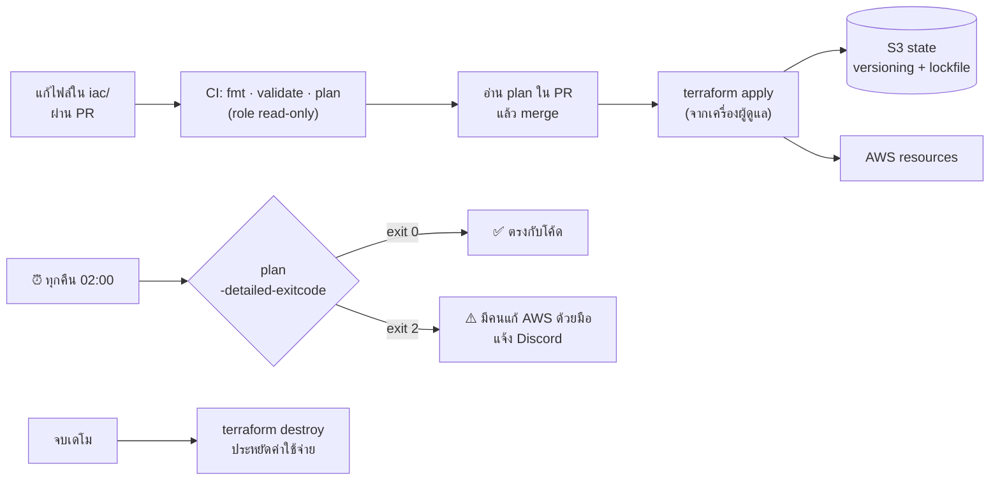
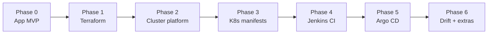
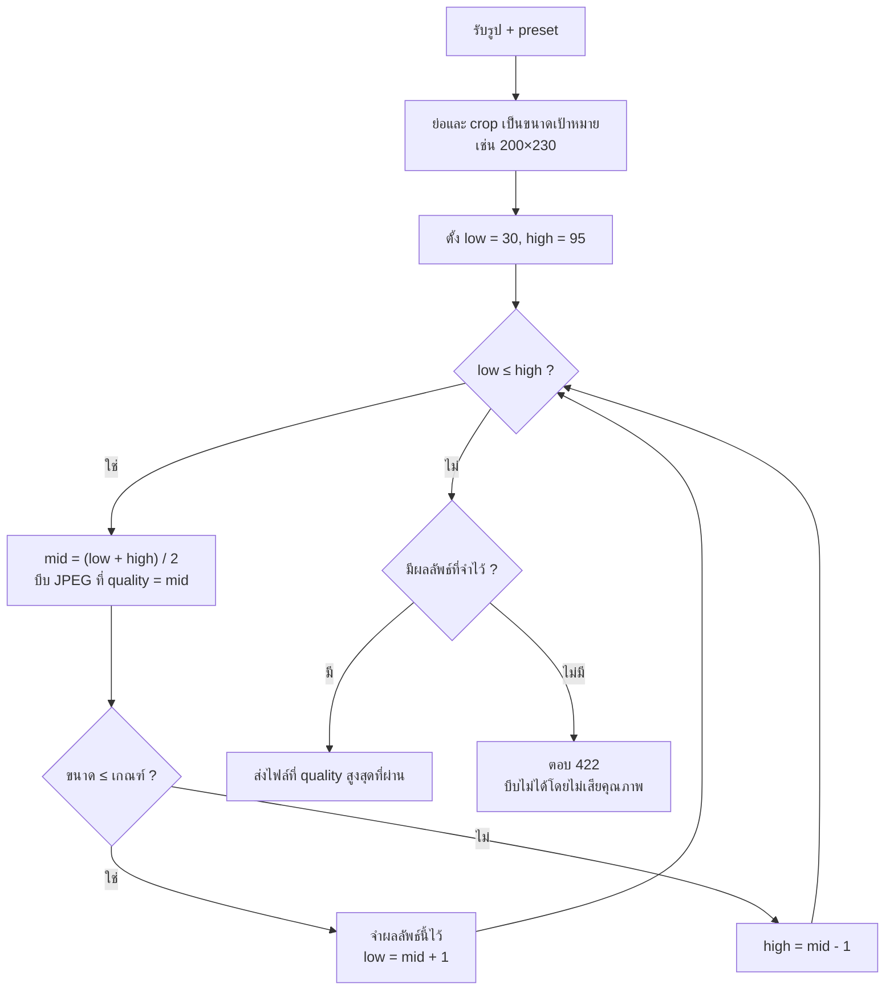

# 🇹🇭 Thai Gov Photo & Doc Processor

> เว็บแปลงรูปถ่ายและเอกสารให้ตรงสเปกระบบรับสมัครของหน่วยงานราชการไทยโดยอัตโนมัติ
> พร้อม **CI/CD pipeline แบบ GitOps** บน **K3s + AWS** ที่สร้างทั้งหมดด้วย **Terraform**


โปรเจกต์นี้ทำขึ้นเพื่อ**เรียนรู้และสาธิตงาน DevOps แบบครบวงจร** ได้แก่ Infrastructure as Code, container, Kubernetes, CI/CD, security scanning, GitOps และการคุมค่าใช้จ่ายบน cloud โดยใช้โจทย์จริงที่คนไทยเจอเป็นตัวแอป

> **ขอบเขตที่ตั้งใจไว้:** ระบบนี้เป็น *production-like* บน EC2 เครื่องเดียว ไม่ได้ออกแบบมาเพื่อ high availability ข้อจำกัดและแนวทางต่อยอดอยู่ใน [หัวข้อ 15](#-15-ข้อจำกัดและ-roadmap)

---

## 📑 สารบัญ

1. [ปัญหาและที่มา](#-1-ปัญหาและที่มา)
2. [ฟีเจอร์](#-2-ฟีเจอร์)
3. [ภาพรวมสถาปัตยกรรม](#-3-ภาพรวมสถาปัตยกรรม)
4. [CI/CD pipeline แบบละเอียด](#-4-cicd-pipeline-แบบละเอียด)
5. [Runtime architecture บน AWS](#-5-runtime-architecture-บน-aws)
6. [Infrastructure as Code (Terraform)](#-6-infrastructure-as-code-terraform)
7. [Tech stack และเหตุผลที่เลือก](#-7-tech-stack-และเหตุผลที่เลือก)
8. [โครงสร้าง repository](#-8-โครงสร้าง-repository)
9. [เริ่มต้นใช้งาน (ทีละขั้น)](#-9-เริ่มต้นใช้งาน-ทีละขั้น)
10. [Build checklist (สิ่งที่ต้องสร้างเอง)](#-10-build-checklist-สิ่งที่ต้องสร้างเอง)
11. [REST API](#-11-rest-api)
12. [Backend: อัลกอริทึมบีบไฟล์](#-12-backend-อัลกอริทึมบีบไฟล์)
13. [Security และ PDPA](#-13-security-และ-pdpa)
14. [ค่าใช้จ่าย](#-14-ค่าใช้จ่าย)
15. [ข้อจำกัดและ roadmap](#-15-ข้อจำกัดและ-roadmap)
16. [หลักฐานการทำงานและบทเรียน](#-16-หลักฐานการทำงานและบทเรียน)

---

## 📌 1. ปัญหาและที่มา

ระบบรับสมัครงานราชการ รัฐวิสาหกิจ และงานทะเบียน มีข้อกำหนดเรื่องไฟล์ที่เข้มงวด:

| หน่วยงาน / วัตถุประสงค์ | ขนาดภาพ | ประเภท | ขนาดไฟล์สูงสุด | เงื่อนไขพิเศษ |
| :--- | :--- | :--- | :--- | :--- |
| **สำนักงาน ก.พ. (OCSC)** | 200 × 230 px (1 × 1.5 นิ้ว) | `.jpg` | **100 KB** (บางรอบ 50–100 KB) | หน้าตรง สัดส่วนต้องไม่บิดเบี้ยว |
| **หนังสือเดินทาง** | 500 × 500 px (2 × 2 นิ้ว) | `.jpg` | **200 KB** | ฉากหลังขาวล้วน |
| **ครูผู้ช่วย / ข้าราชการท้องถิ่น** | 150 × 200 ถึง 300 × 400 px | `.jpg` | **200 KB** | หน้าตรง เครื่องแต่งกายสุภาพ |
| **สำเนาเอกสาร (บัตร ปชช. / ทะเบียนบ้าน)** | A4 หลายหน้า | `.pdf` | รวม **500 KB** | อ่านเลขบัตรได้ชัด |

> ข้อกำหนดจริงเปลี่ยนตามประกาศแต่ละรอบ ค่าในตารางใช้เป็น preset เริ่มต้น และผู้ใช้เลือกแบบ `custom` ได้

**Pain points**

- ผู้ใช้ทั่วไปไม่มีโปรแกรมที่กำหนดขนาดไฟล์เป็น KB ได้แม่นยำ
- ย่อภาพผิดวิธีจนหน้าบิดเบี้ยว แล้วระบบของหน่วยงานปฏิเสธไฟล์
- เว็บแปลงไฟล์ฟรีหลายแห่งไม่มีนโยบายความเป็นส่วนตัวชัดเจน ซึ่งเสี่ยงมากกับสำเนาบัตรประชาชน (PDPA)

---

## ✨ 2. ฟีเจอร์

| ฝั่งผู้ใช้ | ฝั่ง DevOps |
| --- | --- |
| เลือก preset ตามหน่วยงาน ระบบตั้งขนาด น้ำหนักไฟล์ และสีฉากหลังให้ | Infrastructure ทั้งหมดสร้างด้วย Terraform (`apply` / `destroy` ได้ในคำสั่งเดียว) |
| Crop และหมุนภาพ โดยล็อกสัดส่วนตาม preset | Jenkins agent เป็น pod ชั่วคราว สร้างตอน build แล้วลบทิ้ง |
| บีบไฟล์ให้ต่ำกว่าเกณฑ์ KB โดยรักษาความคมชัดสูงสุด | Security gate ด้วย Trivy: เจอช่องโหว่ CRITICAL จะหยุด pipeline จริง |
| รวมหลายภาพเป็น PDF เดียวที่ไม่เกิน 500 KB | GitOps ด้วย Argo CD: Git คือแหล่งความจริงเดียว และ rollback ได้ด้วย `git revert` |
| เทียบขนาดก่อนและหลัง เช่น 3.4 MB → 89 KB | Zero-downtime rolling update พร้อม smoke test หลัง deploy |
| ไฟล์หมดอายุอัตโนมัติ ไม่เก็บถาวร | ไม่มี access key ใน Git ใช้ IAM role ทั้งหมด และเข้าเครื่องผ่าน SSM แทน SSH |

---

## 🗺️ 3. ภาพรวมสถาปัตยกรรม

ภาพนี้แสดงระบบทั้งหมดในภาพเดียว ส่วนรายละเอียดของแต่ละส่วนอยู่ในหัวข้อถัดไป


**สรุปใน 1 ประโยค:** Jenkins ทำหน้าที่ *ตรวจและแพ็ก* โค้ด (CI) แล้วเขียนเวอร์ชันใหม่ลง Git จากนั้น Argo CD *อ่าน Git แล้วเอาขึ้นเว็บจริง* (CD) ส่วน Terraform เป็นคน *สร้างเครื่องและบริการ* บน AWS ทั้งหมด

### 3.1 Diagram แบบละเอียด (แยกตาม tier)

ภาพนี้คือ diagram ชุดเดิมของโปรเจกต์ที่แก้ให้ตรงกับสถาปัตยกรรมปัจจุบันแล้ว: ใช้ BuildKit แทน Kaniko, Argo CD แทน `kubectl rollout`, ไม่เปิด SSH และรวม frontend กับ backend ไว้ใน namespace เดียวกับ Ingress



---

## 🔁 4. CI/CD pipeline แบบละเอียด

### 4.1 ภาพรวม 4 เลน

```mermaid
flowchart TB
    subgraph L1["① Developer & GitHub"]
        direction LR
        a1["สร้าง branch<br/>feat/*"] --> a2["commit & push"] --> a3["เปิด Pull Request<br/>(branch protection)"] --> a4["GitHub webhook<br/>ลงนามด้วย HMAC secret"]
    end

    subgraph L2["② CI · PR pipeline (ตรวจอย่างเดียว ไม่ deploy)"]
        direction LR
        b1["Checkout"] --> b2["Lint<br/>go vet · golangci-lint<br/>eslint · tsc"] --> b3["Unit test<br/>go test -race -cover<br/>npm test"] --> b4["Build image<br/>BuildKit → .tar<br/>(ยังไม่ push)"] --> b5{{"🛡️ Trivy gate<br/>CRITICAL = fail"}} --> b6["Terraform<br/>fmt · validate · plan<br/>(ถ้าแก้ iac/)"] --> b7["ส่งสถานะ ✔/✘<br/>กลับไปที่ PR"]
    end

    subgraph L3["③ CI · main pipeline (build ของจริง)"]
        direction LR
        c1["Build image<br/>tag = git SHA"] --> c2{{"🛡️ Trivy gate<br/>สแกนซ้ำ"}} --> c3["Push ECR<br/>(IMMUTABLE)"] --> c4["แก้ tag ใน<br/>kustomization.yaml<br/>commit [skip ci]"] --> c5["แจ้ง Discord"]
    end

    subgraph L4["④ CD · Argo CD (GitOps)"]
        direction LR
        d1["ตรวจเจอ commit ใหม่<br/>(poll 3 นาที)"] --> d2["Sync เข้า<br/>ns: production"] --> d3["Rolling update<br/>maxUnavailable 0<br/>readinessProbe"] --> d4{{"🧪 Smoke test<br/>PostSync Job"}} --> d5["✅ แจ้งผล / ❌ git revert"]
    end

    a4 --> b1
    b7 --> rv["👀 Code review + Merge"]
    rv --> c1
    c5 --> d1

    classDef gate fill:#fde4e4,stroke:#b83030,color:#5c1414
    classDef pr fill:#e8ebff,stroke:#3f4fc2,color:#1b2270
    classDef main fill:#dff3f4,stroke:#0a7580,color:#053b40
    classDef cd fill:#e3f4e8,stroke:#2b7f43,color:#14401f
    class b1,b2,b3,b4,b6,b7 pr
    class c1,c3,c4,c5 main
    class d1,d2,d3,d5 cd
    class b5,c2,d4 gate
```



> กล่องหกเหลี่ยมสีแดงคือ **ด่านตรวจ** ถ้าไม่ผ่าน pipeline จะหยุดตรงนั้น

### 4.2 แต่ละขั้นทำอะไร

| เลน | ขั้น | ทำอะไร | Tool | ถ้าไม่ผ่าน |
| --- | --- | --- | --- | --- |
| ② PR | Checkout | ดึงโค้ดของ PR เข้า agent pod | Jenkins, git | – |
| ② PR | Lint | ตรวจรูปแบบโค้ดและ type error | `go vet`, golangci-lint, eslint, `tsc --noEmit` | หยุด ✘ |
| ② PR | Unit test | ทดสอบ logic เช่น ไฟล์ออกมาต้อง ≤ 100 KB และขนาด 200×230 จริง | `go test -race -cover`, `npm test` | หยุด ✘ |
| ② PR | Build image | ลอง build ให้แน่ใจว่า Dockerfile ใช้ได้ ผลลัพธ์เก็บเป็น `.tar` | BuildKit (rootless) | หยุด ✘ |
| ② PR | **Security gate** | สแกนช่องโหว่ของ dependency, OS package และ secret ที่หลุดเข้าโค้ด | `trivy fs`, `trivy image --input` | **บล็อก PR** |
| ② PR | Terraform | `fmt -check`, `validate`, `plan` ด้วย role แบบ read-only | Terraform | หยุด ✘ |
| ② PR | Status | ส่ง ✔/✘ เป็น required status check ของ GitHub | GitHub Branch Source | ปุ่ม Merge ถูกล็อก |
| ③ main | Build | build backend และ frontend ติด tag `a1b2c3d` (git SHA) | BuildKit | หยุด |
| ③ main | **Security gate** | สแกน image ตัวสุดท้ายซ้ำ เผื่อมี CVE ใหม่ประกาศหลัง PR ผ่าน | Trivy | **ไม่ push** |
| ③ main | Push | push **ไฟล์ .tar ตัวเดียวกับที่สแกนแล้ว** ขึ้น ECR | crane, IAM role | หยุด |
| ③ main | Update manifest | แก้ `newTag` ใน `k8s/overlays/prod/kustomization.yaml` แล้ว commit กลับ | yq, git | หยุด |
| ④ CD | Detect | Argo CD เห็นว่า Git ไม่ตรงกับ cluster | Argo CD | – |
| ④ CD | Sync | apply manifest, self-heal ถ้ามีคนแก้ใน cluster ด้วยมือ | Argo CD | สถานะ OutOfSync |
| ④ CD | Rolling update | สร้าง pod ใหม่ให้ ready ก่อน แล้วค่อยลบ pod เก่า | Deployment, readinessProbe | pod เก่ายังรับ traffic ต่อ |
| ④ CD | **Smoke test** | Job เรียก `/healthz` และ `/api/v1/selftest` (แปลงรูปตัวอย่างจริง) | PostSync hook | sync = Failed → แจ้ง ❌ |
| ④ CD | Rollback | `git revert` commit ที่แก้ tag แล้ว Argo sync กลับเวอร์ชันเดิม | git, Argo CD | – |

### 4.3 Deploy 1 ครั้งเกิดอะไรขึ้นบ้าง (sequence)



### 4.4 ประวัติ Git ที่เกิดขึ้นจริง



### 4.5 เหตุการณ์ไหนทำให้อะไรรัน

| เหตุการณ์ | สิ่งที่รัน | ขึ้นเว็บจริงไหม |
| --- | --- | --- |
| push เข้า feature branch ที่ยังไม่เปิด PR | ไม่รันอะไร | ไม่ |
| เปิด PR หรือ push เพิ่มเข้า PR | เลน ② (+ terraform plan ถ้าแก้ `iac/`) | ไม่ |
| merge เข้า `main` | เลน ③ ต่อด้วยเลน ④ | ใช่ ภายในไม่กี่นาที |
| commit ที่มี `[skip ci]` (Jenkins อัปเดต tag) | Jenkins ข้าม, Argo CD sync | ใช่ |
| `git revert` บน `main` | Argo CD sync กลับเวอร์ชันเดิม | ใช่ = rollback |
| ทุกคืน 02:00 | Terraform drift detect | ไม่ (แจ้งเตือนอย่างเดียว) |
| สั่ง `terraform apply` จากเครื่อง | เปลี่ยน infrastructure | เปลี่ยน infra |

---

## ☁️ 5. Runtime architecture บน AWS



### 5.1 เส้นทางของผู้ใช้ 1 คน



---

## 🏗️ 6. Infrastructure as Code (Terraform)



**ทรัพยากรที่ Terraform สร้าง**

| ไฟล์ | สร้างอะไร |
| --- | --- |
| `versions.tf` | provider, remote state บน S3 (`use_lockfile`) |
| `network.tf` | VPC, public subnet, Internet Gateway, route table |
| `security_group.tf` | เปิด 80/443 ทุกที่, 6443 เฉพาะ `var.admin_cidr` |
| `iam.tf` | IAM role และ instance profile แบบ least privilege + SSM |
| `ec2.tf` | EC2 t3a.large, Elastic IP, IMDSv2, EBS เข้ารหัส, user_data ติดตั้ง K3s |
| `ecr.tf` | ECR 2 repo, IMMUTABLE, scan on push, lifecycle เก็บ 10 image ล่าสุด |
| `s3.tf` | bucket ไฟล์ผู้ใช้, block public access, SSE, lifecycle 1 วัน |
| `outputs.tf` | public IP, ชื่อ bucket, ECR URL |

สิ่งที่แต่ละไฟล์ต้องมีอยู่ใน [Build checklist Phase 1](#phase-1--terraform)

---

## 🛠️ 7. Tech stack และเหตุผลที่เลือก

| ส่วนประกอบ | เลือกใช้ | เหตุผล | ทางเลือกที่ไม่เลือก และเหตุผล |
| --- | --- | --- | --- |
| Backend | **Go 1.22** | binary เล็ก, ใช้ memory น้อย, concurrency ดี | Node.js: ใช้ memory มากกว่าในงานประมวลผลภาพ |
| Image processing | **bimg (libvips)** | เร็วและใช้ memory น้อยกว่า ImageMagick มาก | ImageMagick: หนักกว่า |
| PDF | **pdfcpu** | pure Go, merge และ optimize ได้ | Ghostscript: ต้องเรียก binary ภายนอก |
| Frontend | **Next.js 14 + Tailwind** | crop และ preview ฝั่ง client, standalone build เล็ก | – |
| Cluster | **K3s** | Kubernetes จริงแต่เบา, มี Traefik และ metrics-server ในตัว | EKS: control plane ~$73/เดือน เกินงบโปรเจกต์ฝึกหัด |
| CI | **Jenkins (Helm) + Kubernetes plugin** | ใช้แพร่หลายในองค์กรไทย, agent เป็น pod ชั่วคราว | GitHub Actions: ง่ายกว่า แต่ตั้งใจฝึก Jenkins |
| CD | **Argo CD** | GitOps, pull-based, Jenkins ไม่ต้องมีสิทธิ์ใน cluster | `kubectl` จาก Jenkins: ต้องให้สิทธิ์ cluster-admin กับ CI |
| Image build | **BuildKit rootless** | ไม่ต้องใช้ Docker socket หรือ privileged | Kaniko: repo ต้นฉบับถูก archive แล้ว / DinD: ต้อง privileged |
| Image push | **crane** | push ไฟล์ `.tar` ตัวเดียวกับที่สแกน (build once) | build ซ้ำตอน push: เสี่ยงได้ image คนละตัวกับที่สแกน |
| Security scan | **Trivy** | สแกน vuln, secret และ misconfig ได้ในตัวเดียว | – |
| Manifest | **Kustomize** | base/overlay, แก้ tag ด้วย yq ได้ง่าย | Helm chart ของแอปเอง: เกินความจำเป็นสำหรับ 2 service |
| Storage | **S3 + lifecycle** | เก็บชั่วคราว ลบเองอัตโนมัติ | EBS/PVC: ไม่หมดอายุเอง |
| Registry | **ECR** | อยู่ region เดียวกัน, IAM auth, scan on push | Docker Hub: rate limit, private repo จำกัด |
| IaC | **Terraform** | declarative, สร้างและลบได้ทั้งระบบ | ClickOps: ทำซ้ำไม่ได้ |
| TLS | **cert-manager + Let's Encrypt** | ออก cert และต่ออายุอัตโนมัติ | – |
| เข้าเครื่อง | **SSM Session Manager** | ไม่เปิด port 22, มี audit log | SSH: ต้องจัดการ key และเปิด port |

---

## 📂 8. โครงสร้าง repository

```text
thai-gov-processor/
├── backend/                         # Go API
│   ├── cmd/api/main.go              # entry point, router, graceful shutdown
│   ├── internal/
│   │   ├── handler/                 # HTTP handlers (preset, merge-pdf, health, selftest)
│   │   ├── processor/               # resize + binary search compress, pdfcpu
│   │   │   └── testdata/            # รูปตัวอย่างสำหรับ unit test และ selftest
│   │   ├── storage/                 # S3 client + presigned URL
│   │   └── preset/                  # ค่า preset ก.พ., passport, ครู
│   ├── Dockerfile
│   └── go.mod / go.sum
├── frontend/                        # Next.js 14
│   ├── src/app/                     # layout.tsx, page.tsx
│   ├── src/components/              # DropZone, PresetCard, ImageCropper, PreviewModal
│   ├── Dockerfile
│   └── package.json
├── iac/                             # Terraform
│   ├── versions.tf  variables.tf  network.tf  security_group.tf
│   ├── iam.tf  ec2.tf  ecr.tf  s3.tf  outputs.tf
│   ├── templates/user_data.sh.tftpl
│   └── terraform.tfvars.example
├── k8s/
│   ├── base/                        # deployment, service, hpa, ingress, smoke-test job
│   ├── overlays/prod/kustomization.yaml   # ← Jenkins แก้ image tag ที่ไฟล์นี้
│   ├── argocd/application.yaml
│   └── platform/
│       ├── jenkins-values.yaml
│       ├── cluster-issuer.yaml
│       └── credential-provider.yaml
├── ci/
│   ├── agent-pod.yaml               # spec ของ Jenkins agent pod
│   └── Jenkinsfile.drift            # job drift detect ทุกคืน
├── scripts/bootstrap-cluster.sh     # ติดตั้ง cert-manager, Argo CD, Jenkins
├── docker-compose.yml               # รันบนเครื่องตัวเอง
├── Jenkinsfile                      # pipeline หลัก (PR + main)
└── README.md
```

---

## 🚀 9. เริ่มต้นใช้งาน (ทีละขั้น)

> README นี้**ตั้งใจไม่ใส่โค้ด** ส่วนนี้บอกแค่ลำดับขั้นและเป้าหมายของแต่ละขั้น ตัวโค้ดให้เขียนเองตาม [Build checklist ในหัวข้อ 10](#-10-build-checklist-สิ่งที่ต้องสร้างเอง)

### 9.0 สิ่งที่ต้องมี

- AWS account + AWS CLI v2 ที่ login แล้ว
- Terraform ≥ 1.10 (ต้องการฟีเจอร์ `use_lockfile` ของ S3 backend)
- Session Manager plugin ของ AWS CLI
- Domain ที่ตั้งค่า DNS ได้ (หรือใช้ `sslip.io` ระหว่างทดสอบ)
- Docker สำหรับรันบนเครื่องตัวเอง

### 9.1 รันบนเครื่องตัวเองให้ได้ก่อน

ใช้ Docker Compose รัน frontend, backend และ MinIO (ใช้แทน S3) ในเครื่องเดียว
**เป้าหมาย:** เปิด `localhost:3000` แล้วแปลงรูป ก.พ. ได้จริงโดยยังไม่แตะ AWS

### 9.2 เตรียม state bucket (ทำด้วยมือครั้งเดียว)

สร้าง S3 bucket สำหรับเก็บ Terraform state แล้วเปิด versioning
**ทำไมต้องทำด้วยมือ:** Terraform ต้องมีที่เก็บ state ก่อนจะเริ่มทำงานได้ จึงใช้ Terraform สร้าง bucket นี้เองไม่ได้ (ปัญหาไก่กับไข่)

### 9.3 สร้าง infrastructure

ใส่ IP ของตัวเองในไฟล์ `terraform.tfvars` จากนั้นรัน `init` → `plan` (อ่านให้เข้าใจว่าจะสร้างอะไร) → `apply`
**เป้าหมาย:** รัน `plan` ซ้ำหลัง apply แล้วต้องขึ้นว่า *No changes*

### 9.4 เข้าเครื่องและติดตั้ง platform

เข้าเครื่องผ่าน SSM Session Manager (ไม่ใช้ SSH) แล้วติดตั้งตามลำดับนี้

1. **ecr-credential-provider** ให้ K3s ดึง image จาก ECR ได้ตลอด เพราะ token ของ ECR อายุแค่ 12 ชม.
2. **cert-manager** + ClusterIssuer ของ Let's Encrypt
3. **Argo CD** + Application ที่ชี้ไปที่ `k8s/overlays/prod`
4. **Jenkins** ผ่าน Helm chart ทางการ

### 9.5 ตั้งค่า GitHub

| ตั้งค่า | ค่า |
| --- | --- |
| Branch protection (`main`) | ต้องผ่าน PR, ต้องผ่าน status check ของ Jenkins, ห้าม force push |
| Webhook | ชี้ไปที่ `https://ci.<domain>/github-webhook/`, content type JSON, ตั้ง secret |
| Fine-grained token (ให้ Jenkins) | เฉพาะ repo นี้: Contents (read/write), Pull requests (read), Commit statuses (read/write) |
| Deploy key (ให้ Argo CD) | read-only |

### 9.6 ตั้งค่า Jenkins Credentials

| ID | ชนิด | ใช้ทำอะไร |
| --- | --- | --- |
| `github-app-token` | Username with password | สแกน repo และ push commit ที่แก้ tag |
| `github-webhook-secret` | Secret text | ตรวจลายเซ็น webhook |
| `discord-webhook` | Secret text | ส่งแจ้งเตือน |
| `aws-tf-readonly` | Username with password (access key / secret) | `terraform plan` และ drift detect (สิทธิ์ ReadOnlyAccess) |

จากนั้นสร้าง **Multibranch Pipeline** ชี้มาที่ repo นี้ และเปิดตัวเลือก "Discover pull requests from origin"

### 9.7 Deploy ครั้งแรก

เปิด PR เล็กๆ รอให้ขึ้น ✔ แล้ว merge จากนั้นดูต่อที่ Jenkins → Argo CD → เว็บจริง

### 9.8 ลบทิ้งหลังเดโม

`terraform destroy` ทันทีที่เดโมเสร็จ state bucket จะยังอยู่ ครั้งหน้า apply ใหม่ได้เลย

---

## 🧩 10. Build checklist (สิ่งที่ต้องสร้างเอง)

แต่ละข้อบอกว่า **ต้องทำอะไรได้**, **คำใบ้** และ **วิธีเช็คว่าทำถูก** ทำเสร็จข้อไหนให้ติ๊ก `[x]` ใน README นี้ได้เลย ส่วนนี้จะกลายเป็นบันทึกความคืบหน้าของโปรเจกต์ไปในตัว



### Phase 0 · App MVP (ใช้เวลากับส่วนนี้ไม่เกิน 30% ของทั้งโปรเจกต์)

- [ ] **Backend: endpoint ครบ 4 ตัว** ได้แก่ `/healthz`, `/api/v1/presets`, `/api/v1/photos/preset`, `/api/v1/selftest`
  - คำใบ้: ทำ preset ก.พ. ให้ใช้ได้ก่อนตัวเดียว ตัวอื่นค่อยเพิ่มทีหลัง
  - เช็ค: ส่งรูป 3 MB เข้าไปแล้วได้ไฟล์ 200×230 ที่ ≤ 100 KB กลับมา
- [ ] **Unit test ของ processor** อย่างน้อย 3 กรณี: รูปใหญ่, รูปเล็กอยู่แล้ว และรูปที่บีบให้ต่ำกว่าเกณฑ์ไม่ได้
  - เช็ค: test ผ่านเมื่อรันพร้อม race detector
- [ ] **Backend Dockerfile** แบบ multi-stage และ runtime รันด้วย user ที่ไม่ใช่ root
  - คำใบ้: bimg ใช้ cgo จึงต้องมี libvips แบบ dev ใน stage build และแบบ runtime ใน stage สุดท้าย
  - เช็ค: image สุดท้ายเล็กกว่า image ของ stage build อย่างเห็นได้ชัด และ `whoami` ใน container ไม่ใช่ root
- [ ] **Frontend แบบเรียบง่าย** มีหน้า upload, ตัวเลือก preset และปุ่มดาวน์โหลด (cropper ค่อยเพิ่มทีหลัง)
  - คำใบ้: ให้เบราว์เซอร์เรียก `/api/...` ตรง ไม่ต้องทำ proxy route ใน Next.js เพราะ Ingress จะแยก path ให้
- [ ] **Docker Compose** รัน 3 service ได้แก่ frontend, backend และ MinIO

### Phase 1 · Terraform

- [ ] **Remote state** เก็บบน S3 เปิด encrypt และ `use_lockfile`
- [ ] **Network**: VPC, public subnet, Internet Gateway และ route table
- [ ] **Security group**: เปิด 80/443 ให้ทุกที่, 6443 เฉพาะ IP ตัวเอง, **ไม่เปิด 22**
- [ ] **IAM**: role + instance profile ที่ให้สิทธิ์เฉพาะ ECR 2 repo, S3 bucket เดียว และ SSM
  - คำใบ้: `ecr:GetAuthorizationToken` ต้องใช้ resource `*` ส่วน action อื่นให้จำกัดเฉพาะ ARN ของ repo
- [ ] **EC2**: หา AMI ด้วย data source แทนการเขียน ID ตายตัว, บังคับ IMDSv2, เข้ารหัส EBS, ใช้ Elastic IP
  - คำใบ้: ตั้ง hop limit ของ metadata เป็น 2 ไม่อย่างนั้น pod จะใช้ IAM role ของเครื่องไม่ได้
  - คำใบ้: ส่ง IP ของ Elastic IP เข้าไปใน user_data ผ่าน template ไม่ต้องไปอ่านจาก metadata ตอนบูต
- [ ] **ECR**: 2 repo แบบ IMMUTABLE, scan on push และ lifecycle policy เก็บ 10 image ล่าสุด
- [ ] **S3 ไฟล์ผู้ใช้**: block public access, SSE, lifecycle หมดอายุ 1 วัน และลบ multipart upload ที่ค้าง
- [ ] **Outputs**: instance id, public IP, ชื่อ bucket และ URL ของ ECR
- เช็คทั้ง phase: `terraform fmt -check` และ `validate` ผ่าน, apply แล้ว plan ซ้ำต้องขึ้น *No changes*, destroy แล้ว apply ใหม่ต้องได้ระบบเดิม

### Phase 2 · Cluster platform

- [ ] **K3s** ติดตั้งผ่าน user_data ใส่ Elastic IP ไว้ใน TLS SAN
  - เช็ค: ใช้ `kubectl` จากเครื่องตัวเองผ่าน port 6443 ได้ และจาก IP อื่นเข้าไม่ได้
- [ ] **ecr-credential-provider**
  - คำใบ้: K3s หา binary และ config ของ credential provider ใน `/var/lib/rancher/credentialprovider/` เป็นค่าเริ่มต้น
  - เช็ค: pod ยังดึง image จาก ECR ได้หลังผ่านไปเกิน 12 ชม.
- [ ] **cert-manager + ClusterIssuer** ของ Let's Encrypt แบบ HTTP-01
  - คำใบ้: ทดสอบกับ staging issuer ก่อน เพื่อไม่ให้ชน rate limit
  - เช็ค: เบราว์เซอร์ขึ้นแม่กุญแจ และ cert ออกโดย Let's Encrypt
- [ ] **Argo CD** ติดตั้งและเข้า UI ได้
- [ ] **Jenkins** ติดตั้งด้วย Helm ตั้ง resource limit ของ controller, PVC 10 GB และติดตั้ง plugin ที่ต้องใช้ (Kubernetes, GitHub Branch Source, Credentials Binding, SCM Skip, Workspace Cleanup)

### Phase 3 · Kubernetes manifests (Kustomize)

- [ ] **Deployment ของ backend และ frontend**
  - readinessProbe และ livenessProbe ที่ `/healthz`
  - rolling update แบบ `maxSurge: 1` / `maxUnavailable: 0`
  - รันแบบ non-root, root filesystem เป็น read-only (mount `/tmp` เป็น emptyDir), drop capabilities ทั้งหมด
  - กำหนด resource requests และ limits
- [ ] **Service** แบบ ClusterIP ของทั้งสองตัว
- [ ] **HPA** ของ backend 2–4 pods ที่ CPU 70%
- [ ] **Ingress** อยู่ namespace เดียวกับ service, `/` ไป frontend, `/api` ไป backend, มี TLS จาก cert-manager
- [ ] **Smoke test Job** เป็น PostSync hook ของ Argo CD เรียก `/healthz` และ `/api/v1/selftest`
- [ ] **Overlay `prod`** กำหนด namespace และช่อง `images` (`newName` / `newTag`) ให้ Jenkins มาแก้ tag ที่นี่
- เช็คทั้ง phase: ลบ pod backend ทิ้ง 1 ตัวระหว่างยิง request ต่อเนื่อง ต้องไม่มี request ที่ error

### Phase 4 · Jenkins CI

- [ ] **Agent pod spec** มี container แยกตามงาน: tools, golang, node, buildkit (rootless), trivy, terraform, aws-cli และ crane
  - คำใบ้: BuildKit แบบ rootless ใน pod ต้องตั้ง seccomp และ AppArmor เป็น Unconfined
  - คำใบ้: pin เวอร์ชันของทุก image ห้ามใช้ `latest`
- [ ] **Pipeline สำหรับ PR**: lint → test → build เป็นไฟล์ `.tar` → Trivy gate → terraform plan (เฉพาะเมื่อแก้ `iac/`)
- [ ] **Pipeline สำหรับ main**: build → Trivy gate → push **ไฟล์ .tar ตัวที่สแกนแล้ว** ขึ้น ECR → แก้ tag ใน overlay → commit กลับ
  - คำใบ้: ใช้เงื่อนไข `when` แยกขั้นที่รันเฉพาะ PR กับเฉพาะ main
  - คำใบ้: ขอ token ของ ECR ด้วย IAM role แล้วเขียน docker config เอง ไม่ต้องเก็บ access key
- [ ] **กันการวนลูป**: commit ที่ Jenkins สร้างเองต้องไม่ trigger pipeline ซ้ำ
- [ ] **แจ้งเตือน** Discord ทั้งตอนผ่านและตอนล้มเหลว
- เช็คทั้ง phase:
  - เปิด PR ที่ใส่ dependency ที่มีช่องโหว่ CRITICAL → PR ต้องขึ้น ✘ และกด Merge ไม่ได้
  - merge PR ปกติ → มี image tag ใหม่ใน ECR และมี commit แก้ tag ใน Git

### Phase 5 · Argo CD

- [ ] **Application** ชี้ไปที่ overlay `prod` เปิด auto sync, prune และ self-heal
- [ ] **Notifications** ส่งเข้า Discord ตอน deployed และตอน sync failed
- เช็คทั้ง phase:
  - `kubectl edit` เปลี่ยน replicas ด้วยมือ → Argo ต้องแก้กลับเอง
  - `git revert` commit ที่แก้ tag → เว็บต้องกลับไปเป็นเวอร์ชันเดิม

> Argo CD **ไม่ rollback ให้เอง** เมื่อ smoke test ไม่ผ่าน มันจะแจ้งว่า sync failed แล้วเราต้อง `git revert` เอง ส่วนระหว่าง rolling update ถ้า pod ใหม่ไม่ ready ตัว Deployment จะไม่ลบ pod เก่า เว็บจึงไม่ล่ม

### Phase 6 · Drift detect และของเสริม

- [ ] **Jenkins job ทุกคืน 02:00 (เวลาไทย)** รัน terraform plan แบบ detailed exit code ถ้าเจอ drift ให้แจ้ง Discord
  - เช็ค: ไปแก้ security group ใน console ด้วยมือ → คืนนั้นต้องมีแจ้งเตือน
- [ ] **AWS Budgets** แจ้งเตือนเมื่อเกิน $10/เดือน
- [ ] **Screenshot และวิดีโอ** สำหรับหัวข้อ 16

### จุดที่มักพลาด

| อาการ | สาเหตุที่พบบ่อย |
| --- | --- |
| pod ขึ้น `ImagePullBackOff` หลังผ่านไปครึ่งวัน | token ของ ECR หมดอายุ (12 ชม.) และไม่มี credential provider |
| pod เรียก AWS แล้วได้ access denied ทั้งที่ role ถูกต้อง | hop limit ของ IMDSv2 ยังเป็น 1 |
| Ingress ส่ง 404 ไปที่ frontend | service อยู่คนละ namespace กับ Ingress |
| pipeline วนรันไม่จบ | commit ที่ Jenkins แก้ tag trigger ตัวเองซ้ำ |
| BuildKit ใน pod error เรื่อง permission | ไม่ได้ตั้ง seccomp/AppArmor เป็น Unconfined หรือ user ไม่ตรงกับเจ้าของ workspace |
| `go test` fail ใน CI แต่ผ่านบนเครื่อง | container ใน CI ไม่มี libvips สำหรับ cgo |
| Trivy เจอช่องโหว่แต่ pipeline ยังผ่าน | ตั้ง exit code เป็น 0 |
| ไฟล์ใน S3 ยังอยู่เกิน 24 ชม. | lifecycle ปัดไปเที่ยงคืน UTC และลบแบบ async (เป็นพฤติกรรมปกติ) |

---

## 📡 11. REST API

| Method | Path | ใช้ทำอะไร |
| --- | --- | --- |
| `GET` | `/healthz` | liveness/readiness probe |
| `GET` | `/api/v1/selftest` | แปลงรูปตัวอย่างที่ฝังไว้ในแอป แล้วเช็คว่าได้ขนาดตรง preset (ใช้ใน smoke test) |
| `GET` | `/api/v1/presets` | รายการ preset ทั้งหมด |
| `POST` | `/api/v1/photos/preset` | แปลงรูปตาม preset |
| `POST` | `/api/v1/documents/merge-pdf` | รวมหลายภาพเป็น PDF เดียว |

### `POST /api/v1/photos/preset` (multipart/form-data)

| field ที่ส่งเข้า | ค่า |
| --- | --- |
| `file` | JPG, PNG, HEIC, WEBP (สูงสุด 15 MB) |
| `preset` | `ocsc` \| `passport` \| `teacher` \| `custom` |
| `width`, `height`, `max_kb` | ใช้เฉพาะ `custom` |

| field ที่ตอบกลับ | ความหมาย |
| --- | --- |
| `filename` | ชื่อไฟล์ผลลัพธ์ |
| `width`, `height` | ขนาดภาพจริงหลังแปลง |
| `size_kb` | ขนาดไฟล์หลังบีบ |
| `quality` | ค่า JPEG quality ที่หาได้ |
| `download_url` | presigned URL ของ S3 |
| `expires_in` | อายุลิงก์เป็นวินาที (3600) |

### `POST /api/v1/documents/merge-pdf` (multipart/form-data)

| field ที่ส่งเข้า | ค่า |
| --- | --- |
| `files[]` | หลายภาพ หรือ PDF ที่สแกนมา |
| `target_max_kb` | ค่าเริ่มต้น `500` |

ตอบกลับ `filename`, `total_pages`, `size_kb`, `download_url` และ `expires_in`

**Error:** `400` ไฟล์ไม่รองรับ · `413` ไฟล์ใหญ่เกิน · `422` บีบให้ต่ำกว่าเกณฑ์ไม่ได้โดยไม่เสียคุณภาพ

---

## ⚡ 12. Backend: อัลกอริทึมบีบไฟล์

**โจทย์:** หาค่า JPEG quality ที่ **สูงที่สุด** (ภาพชัดที่สุด) ซึ่งทำให้ไฟล์ **ยังไม่เกินเกณฑ์** เช่น 100 KB

**แนวคิด:** ยิ่ง quality สูง ไฟล์ยิ่งใหญ่ จึงใช้ **binary search** ในช่วง quality 30–95 ได้ แต่ละรอบลองค่ากลาง ถ้าไฟล์ไม่เกินเกณฑ์ให้จำค่านั้นไว้แล้วลองค่าที่สูงขึ้น ถ้าเกินให้ลองค่าที่ต่ำลง ช่วงนี้มี 66 ค่า จึงใช้ไม่เกิน 7 รอบ (log₂66 ≈ 6.04) แทนการลองไล่ทีละค่า



**ตัวอย่าง** (ตัวเลขขนาดไฟล์เป็นค่าสมมติ) เกณฑ์ 100 KB:

| รอบ | low–high | ลอง quality | ขนาดไฟล์ | ผล |
| --- | --- | --- | --- | --- |
| 1 | 30–95 | 62 | 71 KB | ผ่าน → ลองสูงขึ้น |
| 2 | 63–95 | 79 | 92 KB | ผ่าน → ลองสูงขึ้น |
| 3 | 80–95 | 87 | 118 KB | เกิน → ลองต่ำลง |
| 4 | 80–86 | 83 | 104 KB | เกิน → ลองต่ำลง |
| 5 | 80–82 | 81 | 97 KB | ผ่าน → ลองสูงขึ้น |
| 6 | 82–82 | 82 | 101 KB | เกิน → จบ |

ได้คำตอบ **quality 81** (97 KB) ใช้ 6 รอบ

**สิ่งที่ควรทำเพิ่ม**

- ลบ metadata (EXIF) ออกก่อนบีบ ช่วยลดขนาดไฟล์และลบข้อมูลส่วนตัว เช่น พิกัด GPS
- ใช้การ crop แบบ smart เพื่อให้ใบหน้าอยู่กลางภาพ
- ส่งค่า quality ที่ได้กลับไปใน response ด้วย จะช่วยตอน debug

---

## 🔐 13. Security และ PDPA

### 13.1 ใครมีสิทธิ์ทำอะไร

| ใคร | เข้าถึงอะไร | ยืนยันตัวตนด้วย | secret อยู่ที่ไหน |
| --- | --- | --- | --- |
| GitHub → Jenkins | ส่ง webhook | HMAC signature | Jenkins Credentials |
| Jenkins → ECR | push image | IAM role ของ EC2 | ไม่มี key |
| Jenkins → GitHub | commit tag ใหม่ | fine-grained token เฉพาะ repo | Jenkins Credentials |
| Jenkins → AWS (plan/drift) | อ่านอย่างเดียว | IAM user `tf-readonly` | Jenkins Credentials |
| Argo CD → GitHub | อ่าน repo | deploy key แบบ read-only | K8s Secret (ns argocd) |
| Argo CD → K3s | เขียน ns `production` | ServiceAccount + RBAC | ภายใน cluster |
| K3s → ECR | pull image | ecr-credential-provider + IAM role | ไม่มี key |
| Backend → S3 | Put/Get/Delete เฉพาะ bucket เดียว | IAM role | ไม่มี key |
| ผู้ดูแล → EC2 | shell | SSM Session Manager | ไม่ต้องมี SSH key |

### 13.2 Security controls ตามชั้น

| ชั้น | สิ่งที่ทำ |
| --- | --- |
| โค้ด | lint, unit test, Trivy secret scan (กัน AWS key หลุดเข้า Git) |
| Supply chain | Trivy gate สองรอบ, push ไฟล์ตัวเดียวกับที่สแกน, ECR IMMUTABLE + scan on push, pin เวอร์ชัน image ใน CI |
| Container | non-root, read-only root filesystem, drop capabilities ทั้งหมด, resource limits |
| Cluster | CI ไม่มีสิทธิ์ใน production, มีแค่ Argo CD ที่ deploy ได้, self-heal กันแก้ด้วยมือ |
| Network | เปิดแค่ 80/443, K3s API เฉพาะ IP ผู้ดูแล, ไม่เปิด SSH |
| Host | IMDSv2 บังคับ, EBS เข้ารหัส, Ubuntu LTS |
| Data | S3 block public access, SSE, presigned URL อายุ 1 ชม., ลบ EXIF |

### 13.3 PDPA: ข้อมูลอยู่นานแค่ไหน

| ข้อมูล | อยู่ที่ไหน | อยู่นานเท่าไร |
| --- | --- | --- |
| ไฟล์ต้นฉบับ | `uploads/` ใน S3 | backend ลบทันทีหลังประมวลผลเสร็จ, lifecycle เป็นตัวสำรอง |
| ไฟล์ที่แปลงแล้ว | `processed/` ใน S3 | ลิงก์ดาวน์โหลดใช้ได้ 1 ชม., ไฟล์ถูกลบโดย lifecycle |
| ไฟล์ระหว่างประมวลผล | `emptyDir` ใน pod | หายไปเมื่อ request จบ หรือเมื่อ pod ถูกลบ |
| Log | stdout ของ pod | ไม่ log ชื่อไฟล์เดิมหรือเนื้อหาไฟล์ |

> **หมายเหตุเรื่อง lifecycle:** S3 นับวันหมดอายุโดยปัดไปเที่ยงคืน UTC และลบแบบ asynchronous ไฟล์จึงอาจค้างอยู่ประมาณ 1–2 วัน ไม่ใช่ 24 ชั่วโมงเป๊ะ ด้วยเหตุนี้ backend จึงลบไฟล์ต้นฉบับเองทันที และใช้ lifecycle เป็นตาข่ายรองรับอีกชั้น

---

## 💰 14. ค่าใช้จ่าย

ตัวเลขด้านล่างเป็นค่าประมาณสำหรับ region Singapore **ควรตรวจราคาล่าสุดด้วย [AWS Pricing Calculator](https://calculator.aws/)** ก่อนใช้งานจริง

| รายการ | รายละเอียด | เปิดทิ้งไว้ 1 วัน | เปิดทิ้งไว้ 1 เดือน |
| --- | --- | --- | --- |
| EC2 t3a.large | on-demand ราว $0.09/ชม. | ~$2.2 | ~$66 |
| EBS gp3 35 GB | | ~$0.1 | ~$3.4 |
| Public IPv4 (Elastic IP) | $0.005/ชม. | ~$0.12 | ~$3.6 |
| S3 + ECR | ไฟล์ชั่วคราวและ image < 1 GB | ~$0 | < $1 |
| EKS control plane | **ไม่ได้ใช้** (ใช้ K3s แทน) | $0 | ประหยัด ~$73 |
| **รวมโดยประมาณ** | | **~$2.5 (~85 บาท)** | **~$74 (~2,500 บาท)** |

**วิธีคุมงบ**

- `terraform apply` ก่อนเดโมหรือสัมภาษณ์ แล้ว `terraform destroy` ทันทีที่เสร็จ ค่าใช้จ่ายจะเหลือหลักสิบบาทต่อครั้ง
- ตั้ง **AWS Budgets** แจ้งเตือนเมื่อค่าใช้จ่ายเกิน $10/เดือน
- state bucket และ ECR ที่เหลือหลัง destroy มีค่าใช้จ่ายแทบเป็นศูนย์

---

## 🧭 15. ข้อจำกัดและ roadmap

### ข้อจำกัดที่รู้อยู่แล้ว

| ข้อจำกัด | ผลกระทบ | ถ้าจะแก้ |
| --- | --- | --- |
| Single node | เครื่องล่ม = เว็บล่ม, HPA ขยายได้แค่ในเครื่องเดียว | EKS หรือ K3s หลาย node + ALB |
| ทุก pod ใช้ IAM role ของเครื่องร่วมกัน | pod ใดก็ได้เรียกสิทธิ์ push ECR ได้ | EKS Pod Identity / IRSA แยก role ต่อ ServiceAccount |
| Jenkins อยู่เครื่องเดียวกับแอป | build หนักๆ อาจแย่ง CPU/RAM จากเว็บ | resource limit (ทำแล้ว) หรือแยก node สำหรับ CI |
| Jenkins เปิดสู่ internet เพื่อรับ webhook | เป็นเป้าโจมตี | จำกัด IP ให้เฉพาะช่วง IP webhook ของ GitHub หรือใช้ smee/relay |
| Rollback ต้องทำเอง | ต้องมีคน `git revert` | Argo Rollouts + analysis อัตโนมัติ |

### Roadmap

- [ ] Terraform + remote state
- [ ] Jenkins PR/main pipeline + Trivy gate
- [ ] Argo CD GitOps + smoke test
- [ ] Namespace `staging` + promote ไป `production` ด้วย PR
- [ ] Observability: Prometheus + Grafana (แบบเบา) และ dashboard latency/error rate
- [ ] Argo Rollouts (canary) + rollback อัตโนมัติ
- [ ] Sign image ด้วย cosign + verify ตอน deploy
- [ ] Policy as code (Kyverno): บังคับ non-root, ห้ามใช้ tag `latest`
- [ ] Load test ด้วย k6 แล้วดู HPA ขยาย pod จริง

---

## 📸 16. หลักฐานการทำงานและบทเรียน

> แทนที่ภาพในส่วนนี้ด้วย screenshot จริงจากระบบของคุณ

| หลักฐาน | ภาพ |
| --- | --- |
| Jenkins stage view (PR ผ่าน) | `docs/images/jenkins-pr-pass.png` |
| PR ที่ Trivy บล็อก | `docs/images/trivy-blocked.png` |
| Argo CD แสดง Synced / Healthy | `docs/images/argocd-healthy.png` |
| Rollback ด้วย `git revert` | `docs/images/rollback.gif` |
| แจ้งเตือนใน Discord | `docs/images/discord.png` |
| `terraform apply` / `destroy` | `docs/images/terraform.png` |

### ปัญหาที่เจอและวิธีแก้ (บันทึกระหว่างทำ)

| ปัญหา | สาเหตุ | วิธีแก้ |
| --- | --- | --- |
| _ตัวอย่าง:_ pod ขึ้น `ImagePullBackOff` หลังผ่านไป 12 ชม. | token ของ ECR หมดอายุ | ติดตั้ง ecr-credential-provider |
| _ตัวอย่าง:_ pipeline วนรันไม่จบ | Jenkins commit tag แล้ว trigger ตัวเองซ้ำ | ใส่ `[skip ci]` + SCM Skip plugin |
| _เพิ่มของคุณเอง_ | | |

---

## 📄 License

MIT
