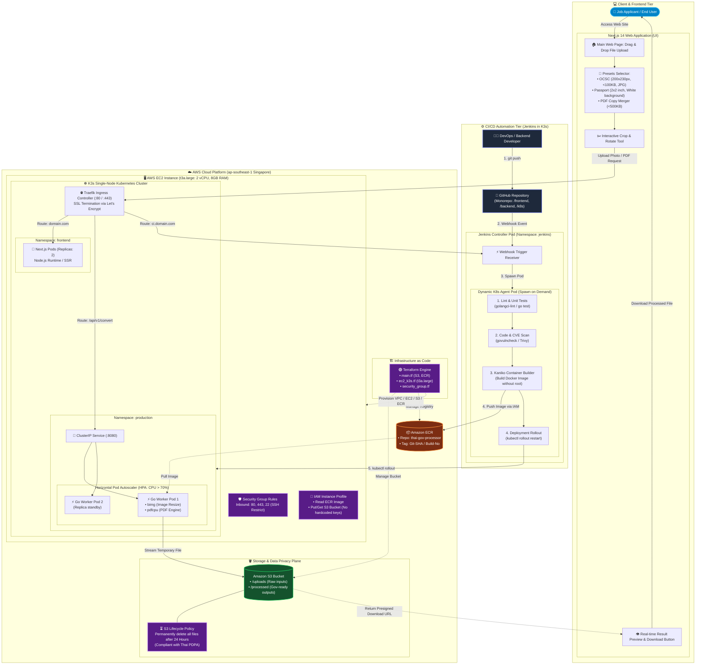

# Thai Gov Photo & Doc Processor (Cloud-Native Edition)

Production-grade Cloud-Native Microservice & Modern Web Application สำหรับแปลงไฟล์รูปถ่ายและจัดการเอกสารราชการไทยให้ถูกต้องตามข้อกำหนด 100% อัตโนมัติ รันบน Single-Node Kubernetes (K3s) บน AWS ควบคุมโครงสร้างพื้นฐานด้วย Terraform และมีระบบ CI/CD อัตโนมัติด้วย Jenkins Dynamic Pod Agents

---

## 📌 1. ปัญหาจริงและที่มาของโครงการ (Problem Statement)

ระบบรับสมัครงานราชการ รัฐวิสาหกิจ และงานทะเบียนของประเทศไทย (เช่น สำนักงาน ก.พ., ครูผู้ช่วย, ตำรวจ, กรมการกงสุล/ทำพาสปอร์ต) มีเงื่อนไขการอัปโหลดไฟล์ที่เคร่งครัดและตายตัวมาก:

| หน่วยงาน / วัตถุประสงค์ | มิติภาพ (Resolution) | ประเภทไฟล์ | ขนาดไฟล์สูงสุด (Max Size) | ข้อกำหนดพิเศษ |
| :--- | :--- | :--- | :--- | :--- |
| **สำนักงาน ก.พ. (OCSC)** | 200 x 230 px (1 x 1.5 นิ้ว) | `.jpg` / `.jpeg` | ห้ามเกิน **100 KB** (บางรอบ 50–100 KB) | สัดส่วนหน้าตรง 4:5 ห้ามบิดเบี้ยว |
| **ระบบทำพาสปอร์ต (Passport)** | 500 x 500 px หรือ 2 x 2 นิ้ว | `.jpg` | ห้ามเกิน **200 KB** | ฉากหลังขาวล้วน (RGB 255,255,255) |
| **ครูผู้ช่วย / ข้าราชการท้องถิ่น** | 150 x 200 px ถึง 300 x 400 px | `.jpg` | ไม่เกิน **200 KB** | หน้าตรง เสื้อสุภาพ/เครื่องแบบ |
| **สำเนาเอกสาร (บัตร ปชช. / ทะเบียนบ้าน)** | A4 Multi-page | `.pdf` | รวมกันห้ามเกิน **500 KB** | DPI คมชัด อ่านเลขบัตรได้ชัดเจน |

### Pain Point ของผู้ใช้งาน
* **ขาดเครื่องมือเฉพาะทาง:** ผู้ใช้ทั่วไปไม่มีโปรแกรมตัดต่ออย่าง Photoshop และการใช้โปรแกรมตกแต่งภาพทั่วไปไม่สามารถระบุขนาดไฟล์ (KB) ให้แม่นยำได้
* **ภาพแตกหรือผิดสัดส่วน:** การย่อภาพแบบผิดวิธีทำให้สัดส่วนใบหน้าบิดเบี้ยวจนระบบตรวจจับใบหน้าของหน่วยงานปฏิเสธการอัปโหลด
* **ความเสี่ยงด้านข้อมูลส่วนบุคคล (PDPA):** เว็บไซต์แปลงไฟล์ฟรีบนอินเทอร์เน็ตมักไม่มีนโยบายความเป็นส่วนตัวที่ชัดเจน และอาจนำสำเนาบัตรประชาชนไปจัดเก็บไว้ถาวร

---

## 🚀 2. System Architecture & Diagram

ระบบถูกออกแบบตามหลักการ **Cloud-Native Architecture** โดยบูรณาการทั้ง Client (Next.js), Runtime (K3s), Storage (S3), และ CI/CD Automation (Jenkins Dynamic Agents) ไว้บน AWS:



## 🛠️ 3. Tech Stack & Architectural Decisions

| ส่วนประกอบ | เทคโนโลยีที่เลือก | เหตุผลทางเทคนิค (Why this?) |
| --- | --- | --- |
| **Backend API** | **Go 1.22+** | รันเร็วระดับ Microseconds, Binary เล็ก, จัดการ Goroutines สูง, Memory Footprint ต่ำกว่า Node/Java 5-10 เท่า |
| **Image Processing** | `h2non/bimg` (libvips) | ประมวลผลภาพเร็วกว่า ImageMagick 4–8 เท่า และกิน Memory น้อยกว่ามาก |
| **PDF Processing** | `pdfcpu` | Pure Go PDF Processor จัดการ Split/Merge และ Optimize ขนาดไฟล์ได้อย่างรวดเร็ว |
| **Frontend UI** | **Next.js 14 (App Router)** | รองรับ Client-Side Image Crop/Canvas Preview และทำ Server-Side Rendering (SSR) ปลอดภัยต่อการทำ API Proxy |
| **Styling** | **Tailwind CSS + Lucide Icons** | ออกแบบ UI สะอาดตา สไตล์ราชการยุคใหม่ (GovTech) พร้อม Responsive Design 100% |
| **Container Engine** | **K3s (Kubernetes)** | น้ำหนักเบามาก (ใช้ RAM < 512MB สำหรับ K3s Base) มี Ingress (Traefik) ในตัว ไม่ต้องจ่ายค่า EKS Master Node ($73/เดือน) |
| **CI/CD Platform** | **Jenkins on K3s** | ติดตั้งผ่าน Official Helm Chart ใช้ Dynamic Kubernetes Pod Agent รันงานเฉพาะตอน Build ไม่เปลือง RAM เครื่อง |
| **Container Builder** | **Google Kaniko** | Build Docker image ภายใน Kubernetes Pod ได้โดยตรงโดยไม่ต้องใช้ Docker-in-Docker (DinD) หรือเปิดสิทธิ์ root socket (`/var/run/docker.sock`) |
| **Security Scanning** | **Trivy + govulncheck** | สแกนช่องโหว่ระดับ Dependencies และระดับ OS Packages ใน Container Image ก่อน Push |
| **Cloud Storage** | **Amazon S3** | เก็บไฟล์ชั่วคราว พร้อมตั้ง **S3 Lifecycle Rules ลบไฟล์ทิ้งอัตโนมัติภายใน 24 ชม.** เพื่อความปลอดภัยตามกฎหมาย PDPA |
| **Artifact Registry** | **Amazon ECR** | เก็บ Private Docker Images ภายใน Region เดียวกัน (ap-southeast-1) ดึง Image ฟรี ไม่เสียค่า Data Transfer |
| **Infrastructure as Code** | **Terraform** | จัดการ Lifecycle ของ Cloud ทั้งหมดแบบ Declarative สามารถสั่ง `apply` และ `destroy` เพื่อคุมงบได้ทันที |

---

## 📂 4. Project Directory Structure (Monorepo)

```text
thai-gov-processor/
├── .github/
│   └── workflows/              # GitHub Actions (ทางเลือกสำรอง หรือ Trigger Webhook)
├── backend/                    # Go API Microservice
│   ├── cmd/
│   │   └── api/
│   │       └── main.go         # Entry point, Router & Dependency Injection
│   ├── internal/
│   │   ├── handler/            # HTTP Handlers (Multipart, Presets, Health)
│   │   ├── processor/          # Core Logic: bimg resize, binary search compress, pdfcpu
│   │   ├── storage/            # S3 Client wrapper & Presigned URL generator
│   │   └── preset/             # Thai Gov Presets (ก.พ., Passport, etc.)
│   ├── Dockerfile              # Multi-stage Docker build with libvips-dev
│   ├── go.mod
│   └── go.sum
├── frontend/                   # Next.js 14 Application
│   ├── src/
│   │   ├── app/
│   │   │   ├── layout.tsx
│   │   │   ├── page.tsx        # Single-page Web App UI
│   │   │   └── api/convert/    # Next.js Proxy Route
│   │   ├── components/
│   │   │   ├── DropZone.tsx    # Drag & drop upload area
│   │   │   ├── PresetCard.tsx  # Preset selector component
│   │   │   ├── ImageCropper.tsx# Interactive canvas cropper (react-image-crop)
│   │   │   └── PreviewModal.tsx# Result visualizer & Download trigger
│   │   └── lib/
│   │       └── utils.ts
│   ├── Dockerfile              # Next.js Standalone build
│   ├── package.json
│   └── tailwind.config.ts
├── iac/                        # Terraform Infrastructure
│   ├── main.tf                 # Provider, S3 Bucket, Lifecycle Configuration
│   ├── ecr.tf                  # ECR Repositories (Backend & Frontend)
│   ├── security_group.tf       # EC2 Security Group (22, 80, 443, 6443)
│   ├── iam.tf                  # IAM Role & Instance Profile for EC2
│   ├── ec2_k3s.tf              # EC2 t3a.large Instance with UserData K3s Setup
│   ├── variables.tf
│   └── outputs.tf
├── k8s/                        # Kubernetes Manifests
│   ├── base/
│   │   ├── backend-deployment.yaml
│   │   ├── backend-service.yaml
│   │   ├── backend-hpa.yaml
│   │   ├── frontend-deployment.yaml
│   │   ├── frontend-service.yaml
│   │   └── ingress.yaml        # Traefik Ingress Routes
│   └── jenkins/
│       └── values.yaml         # Helm Values for Jenkins Controller on K3s
├── Jenkinsfile                 # Declarative Pipeline with Dynamic Kubernetes Pod Agent
└── README.md

```

---

## ⚡ 5. Backend Implementation (Go Core Processor)

Backend ใช้เทคนิค **Binary Search (ค้นหาทวิภาค)** เพื่อหาค่า Quality ของภาพ JPEG ที่ทำให้ไฟล์มีขนาดต่ำกว่าเกณฑ์สูงสุด (เช่น 100 KB) โดยยังคงความคมชัดสูงสุด และใช้เวลาประมวลผลน้อยที่สุด (ลูปไม่เกิน 7 ครั้ง):

```go
package processor

import (
	"errors"
	"fmt"
	"[github.com/h2non/bimg](https://github.com/h2non/bimg)"
)

type ProcessOptions struct {
	TargetWidth    int
	TargetHeight   int
	MaxSizeBytes   int    // เช่น 100 * 1024 (100KB)
	Format         string // "jpeg"
	EnforceWhiteBg bool
}

// ProcessPhoto Resize และบีบอัดรูปภาพด้วย Binary Search
func ProcessPhoto(inputBuffer []byte, opts ProcessOptions) ([]byte, error) {
	img := bimg.NewImage(inputBuffer)

	// 1. ตรวจสอบและแปลงสัดส่วนภาพแบบ Force Resize หรือ Smart Crop
	resized, err := img.Process(bimg.Options{
		Width:   opts.TargetWidth,
		Height:  opts.TargetHeight,
		Crop:    true,
		Gravity: bimg.GravityCentre,
		Type:    bimg.JPEG,
	})
	if err != nil {
		return nil, fmt.Errorf("failed to resize: %w", err)
	}

	// 2. Binary Search หาค่า Quality ที่ดีที่สุดที่ขนาดไฟล์ <= opts.MaxSizeBytes
	lowQuality := 30
	highQuality := 95
	bestQuality := lowQuality
	var finalBuffer []byte

	for lowQuality <= highQuality {
		midQuality := (lowQuality + highQuality) / 2
		compressed, err := bimg.NewImage(resized).Process(bimg.Options{
			Quality: midQuality,
			Type:    bimg.JPEG,
		})
		if err != nil {
			return nil, err
		}

		if len(compressed) <= opts.MaxSizeBytes {
			// เก็บผลลัพธ์ที่ดีที่สุดไว้ แล้วลองขยับ Quality ให้ชัดขึ้นอีก
			bestQuality = midQuality
			finalBuffer = compressed
			lowQuality = midQuality + 1
		} else {
			// ขนาดไฟล์เกินเป้าหมาย ลด Quality ลง
			highQuality = midQuality - 1
		}
	}

	if finalBuffer == nil {
		return nil, errors.New("cannot compress image below target size without extreme degradation")
	}

	return finalBuffer, nil
}

```

---

## 📡 6. REST API Specification

### 1. `POST /api/v1/photos/preset`

แปลงรูปภาพตามพรีเซ็ตที่กำหนด

* **Headers:** `Content-Type: multipart/form-data`
* **Form-Data Parameters:**
* `file`: Binary Data (JPG, PNG, HEIC, WEBP)
* `preset`: `ocsc` | `passport` | `teacher` | `custom`
* `width`: (Optional สำหรับ `custom`)
* `height`: (Optional สำหรับ `custom`)
* `max_kb`: (Optional สำหรับ `custom`)


* **Response (JSON):**
```json
{
  "status": "success",
  "data": {
    "filename": "ocsc_photo_a8f3c1.jpg",
    "width": 200,
    "height": 230,
    "size_kb": 84.6,
    "mime_type": "image/jpeg",
    "download_url": "[https://thai-gov-photos.s3.ap-southeast-1.amazonaws.com/processed/ocsc_photo_a8f3c1.jpg?AWSAccessKeyId=](https://thai-gov-photos.s3.ap-southeast-1.amazonaws.com/processed/ocsc_photo_a8f3c1.jpg?AWSAccessKeyId=)...",
    "expires_in": 3600
  }
}

```


### 2. `POST /api/v1/documents/merge-pdf`

รวมไฟล์ภาพหลายรูปเป็น PDF เดียว พร้อมคุมขนาดไม่เกิน 500 KB

* **Headers:** `Content-Type: multipart/form-data`
* **Form-Data Parameters:**
* `files[]`: Multiple Images / Scanned PDF
* `target_max_kb`: `500`


* **Response (JSON):**
```json
{
  "status": "success",
  "data": {
    "filename": "id_card_merged.pdf",
    "total_pages": 2,
    "size_kb": 412.3,
    "download_url": "[https://thai-gov-photos.s3.ap-southeast-1.amazonaws.com/processed/id_card_merged.pdf](https://thai-gov-photos.s3.ap-southeast-1.amazonaws.com/processed/id_card_merged.pdf)?...",
    "expires_in": 3600
  }
}

```


---

## 🖥️ 7. Frontend UI / UX Features (Next.js 14)

1. **Preset-driven User Flow:**
* ผู้ใช้กดเลือกหน่วยงานที่ต้องการยื่นเอกสาร (ระบบจะตั้งค่ากว้าง x ยาว, น้ำหนักไฟล์ และเงื่อนไขสีฉากหลังให้อัตโนมัติ)


2. **Client-Side Image Manipulation (Interactive Cropper):**
* ใช้ `react-image-crop` เพื่อให้ผู้ใช้หมุน (Rotate 90°), พลิกภาพ (Flip), และลากกรอบครอบตัดภาพเฉพาะศีรษะถึงหน้าอก โดยระบบจะบังคับ Aspect Ratio (เช่น 4:5 สำหรับ ก.พ.) เพื่อป้องกันภาพผิดสัดส่วน


3. **Instant Validation Engine:**
* ตรวจสอบสกุลไฟล์และขนาดภาพตั้งแต่หน้าบ้าน (Client-side validation) แจ้งเตือนทันทีหากไฟล์เสียหาย


4. **Before / After Comparison Slider:**
* แสดงขนาดไฟล์เดิมเทียบกับขนาดไฟล์ใหม่ (เช่น `3.4 MB` $\rightarrow$ `89 KB`) พร้อมปุ่มดาวน์โหลดไฟล์ความละเอียดสูงสุด


---

## 🏗️ 8. Infrastructure as Code (Terraform)

#### `iac/main.tf`

```hcl
terraform {
  required_version = ">= 1.5.0"
  required_providers {
    aws = {
      source  = "hashicorp/aws"
      version = "~> 5.0"
    }
  }
}

provider "aws" {
  region = var.aws_region
}

# S3 Bucket สำหรับเก็บรูปภาพและเอกสารชั่วคราว
resource "aws_s3_bucket" "photo_storage" {
  bucket_prefix = "thai-gov-photos-"
  force_destroy = true
}

# S3 Lifecycle Rule: ลบไฟล์ทิ้งถาวรอัตโนมัติหลัง 24 ชั่วโมง
resource "aws_s3_bucket_lifecycle_configuration" "photo_lifecycle" {
  bucket = aws_s3_bucket.photo_storage.id

  rule {
    id     = "auto-delete-24h-temp-files"
    status = "Enabled"
    expiration {
      days = 1
    }
  }
}

# AWS ECR Repositories
resource "aws_ecr_repository" "backend_repo" {
  name                 = "thai-gov-processor-backend"
  image_tag_mutability = "MUTABLE"

  image_scanning_configuration {
    scan_on_push = true
  }
}

resource "aws_ecr_repository" "frontend_repo" {
  name                 = "thai-gov-processor-frontend"
  image_tag_mutability = "MUTABLE"

  image_scanning_configuration {
    scan_on_push = true
  }
}

```

#### `iac/security_group.tf`

```hcl
resource "aws_security_group" "k3s_sg" {
  name        = "k3s-cluster-sg"
  description = "Security group for single-node K3s cluster"

  ingress {
    description = "SSH access"
    from_port   = 22
    to_port     = 22
    protocol    = "tcp"
    cidr_blocks = ["0.0.0.0/0"]
  }

  ingress {
    description = "K3s API"
    from_port   = 6443
    to_port     = 6443
    protocol    = "tcp"
    cidr_blocks = ["0.0.0.0/0"]
  }

  ingress {
    description = "HTTP Inbound"
    from_port   = 80
    to_port     = 80
    protocol    = "tcp"
    cidr_blocks = ["0.0.0.0/0"]
  }

  ingress {
    description = "HTTPS Inbound"
    from_port   = 443
    to_port     = 443
    protocol    = "tcp"
    cidr_blocks = ["0.0.0.0/0"]
  }

  egress {
    from_port   = 0
    to_port     = 0
    protocol    = "-1"
    cidr_blocks = ["0.0.0.0/0"]
  }
}

```

#### `iac/ec2_k3s.tf`

```hcl
resource "aws_iam_role" "k3s_instance_role" {
  name = "k3s-instance-role"

  assume_role_policy = jsonencode({
    Version = "2012-10-17"
    Statement = [{
      Action    = "sts:AssumeRole"
      Effect    = "Allow"
      Principal = { Service = "ec2.amazonaws.com" }
    }]
  })
}

resource "aws_iam_role_policy_attachment" "ecr_read" {
  role       = aws_iam_role.k3s_instance_role.name
  policy_arn = "arn:aws:iam::aws:policy/AmazonEC2ContainerRegistryPowerUser"
}

resource "aws_iam_role_policy" "s3_access" {
  name = "k3s-s3-access"
  role = aws_iam_role.k3s_instance_role.id

  policy = jsonencode({
    Version = "2012-10-17"
    Statement = [{
      Effect = "Allow"
      Action = [
        "s3:PutObject",
        "s3:GetObject",
        "s3:DeleteObject"
      ]
      Resource = "${aws_s3_bucket.photo_storage.arn}/*"
    }]
  })
}

resource "aws_iam_instance_profile" "k3s_profile" {
  name = "k3s-instance-profile"
  role = aws_iam_role.k3s_instance_role.name
}

resource "aws_instance" "k3s_node" {
  ami                  = "ami-0b940e4f1a2380590" # Ubuntu 24.04 LTS (ap-southeast-1)
  instance_type        = "t3a.large"             # 2 vCPU, 8GB RAM
  key_name             = var.key_pair_name
  vpc_security_group_ids = [aws_security_group.k3s_sg.id]
  iam_instance_profile = aws_iam_instance_profile.k3s_profile.name

  root_block_device {
    volume_size = 35 # GB
    volume_type = "gp3"
  }

  user_data = <<-EOF
              #!/bin/bash
              apt-get update -y
              apt-get install -y curl snapd

              PUBLIC_IP=$(curl -s [http://169.254.169.254/latest/meta-data/public-ipv4](http://169.254.169.254/latest/meta-data/public-ipv4))
              
              # ติดตั้ง K3s 
              curl -sfL [https://get.k3s.io](https://get.k3s.io) | INSTALL_K3S_EXEC="--tls-san $PUBLIC_IP --write-kubeconfig-mode 644" sh -
              
              # ติดตั้ง Helm
              snap install helm --classic
              snap install aws-cli --classic
              EOF

  tags = {
    Name = "k3s-thai-gov-processor"
  }
}

```

---

## ☸️ 9. Kubernetes & Ingress Manifests

#### `k8s/base/ingress.yaml`

```yaml
apiVersion: networking.k8s.io/v1
kind: Ingress
metadata:
  name: app-ingress
  namespace: production
  annotations:
    traefik.ingress.kubernetes.io/router.entrypoints: web
spec:
  rules:
  - host: photo-gov.your-ip.nip.io
    http:
      paths:
      - path: /api
        pathType: Prefix
        backend:
          service:
            name: backend-service
            port:
              number: 8080
      - path: /
        pathType: Prefix
        backend:
          service:
            name: frontend-service
            port:
              number: 3000

```

---

## 🔄 10. CI/CD Pipeline Configuration (`Jenkinsfile`)

ใช้ **Kubernetes Plugin** บน Jenkins เพื่อ Spawn Dynamic Pod Agent (Golang, Kaniko, Trivy) ขึ้นมารันงานเฉพาะตอน Build แล้วลบทิ้งเมื่อเสร็จสิ้น:

```groovy
pipeline {
  agent {
    kubernetes {
      yaml '''
apiVersion: v1
kind: Pod
metadata:
  labels:
    role: jenkins-agent
spec:
  serviceAccountName: jenkins-admin
  containers:
  - name: golang
    image: golang:1.22-alpine
    command: ['cat']
    tty: true
  - name: kaniko
    image: gcr.io/kaniko-project/executor:debug
    command: ['cat']
    tty: true
  - name: trivy
    image: aquasec/trivy:latest
    command: ['cat']
    tty: true
'''
    }
  }

  environment {
    AWS_REGION    = 'ap-southeast-1'
    ECR_REGISTRY  = 'xxxxxxxxxxxx.dkr.ecr.ap-southeast-1.amazonaws.com'
    IMAGE_BACKEND = "${ECR_REGISTRY}/thai-gov-processor-backend"
    TAG           = "${BUILD_NUMBER}-${GIT_COMMIT.take(7)}"
  }

  stages {
    stage('Unit Test & Benchmark') {
      steps {
        container('golang') {
          dir('backend') {
            sh 'go test -v -race -cover ./...'
          }
        }
      }
    }

    stage('Security Scan (SAST)') {
      steps {
        container('trivy') {
          sh 'trivy fs --severity HIGH,CRITICAL --exit-code 0 backend/'
        }
      }
    }

    stage('Build & Push to ECR via Kaniko') {
      steps {
        container('kaniko') {
          sh """
          /kaniko/executor \
            --context=dir://./backend \
            --dockerfile=backend/Dockerfile \
            --destination=${IMAGE_BACKEND}:${TAG} \
            --destination=${IMAGE_BACKEND}:latest
          """
        }
      }
    }

    stage('Scan Container Image (CVEs)') {
      steps {
        container('trivy') {
          sh "trivy image --severity CRITICAL --exit-code 0 ${IMAGE_BACKEND}:${TAG}"
        }
      }
    }

    stage('Deploy to K3s Production') {
      steps {
        sh "kubectl set image deployment/backend-deployment processor=${IMAGE_BACKEND}:${TAG} -n production"
        sh "kubectl rollout status deployment/backend-deployment -n production --timeout=120s"
      }
    }
  }

  post {
    always {
      cleanWs()
    }
    failure {
      echo "Deployment failed! Review build logs immediately."
    }
  }
}

```

---

## 💰 11. Cost Optimization & Budgeting

| Service / Resource | รายละเอียดการคำนวณ | ค่าใช้จ่าย (เปิดทิ้งไว้ 1 วัน) | ค่าใช้จ่าย (เปิดทิ้งไว้ 1 เดือน) |
| --- | --- | --- | --- |
| **AWS EC2 (t3a.large)** | 2 vCPU, 8GB RAM ($0.0752/ชม.) | ~60 บาท / วัน | ~1,850 บาท / เดือน |
| **Amazon S3** | Storage < 1GB + S3 Lifecycle 24 ชม. | ~0.00 บาท | ~0.50 บาท / เดือน |
| **Amazon ECR** | เก็บ Docker Image < 200MB | ~0.00 บาท | ~0.60 บาท / เดือน |
| **EKS Control Plane** | **ไม่ได้ใช้** (หันมาใช้ K3s บน EC2 แทน) | **ประหยัดได้ 100%** | **ประหยัดไป $73 (~2,600 บาท)** |
| **รวมโดยประมาณ** |  | **~60 บาท / วัน** | **~1,850 บาท / เดือน** |

> 💡 **Best Practice ในการประหยัดงบ:**
> ในการนำเสนอผลงาน ให้รัน `terraform apply` ก่อนการสัมภาษณ์หรืออัดวิดีโอสาธิต จากนั้นเมื่อเสร็จสิ้นให้สั่ง `terraform destroy` ทันที จะเสียค่าใช้จ่ายจริงเพียง **ไม่กี่บาทต่อการทดสอบ**

---
