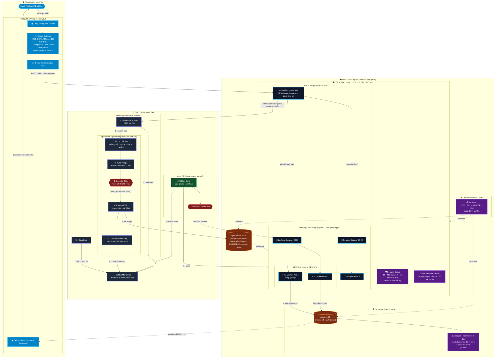
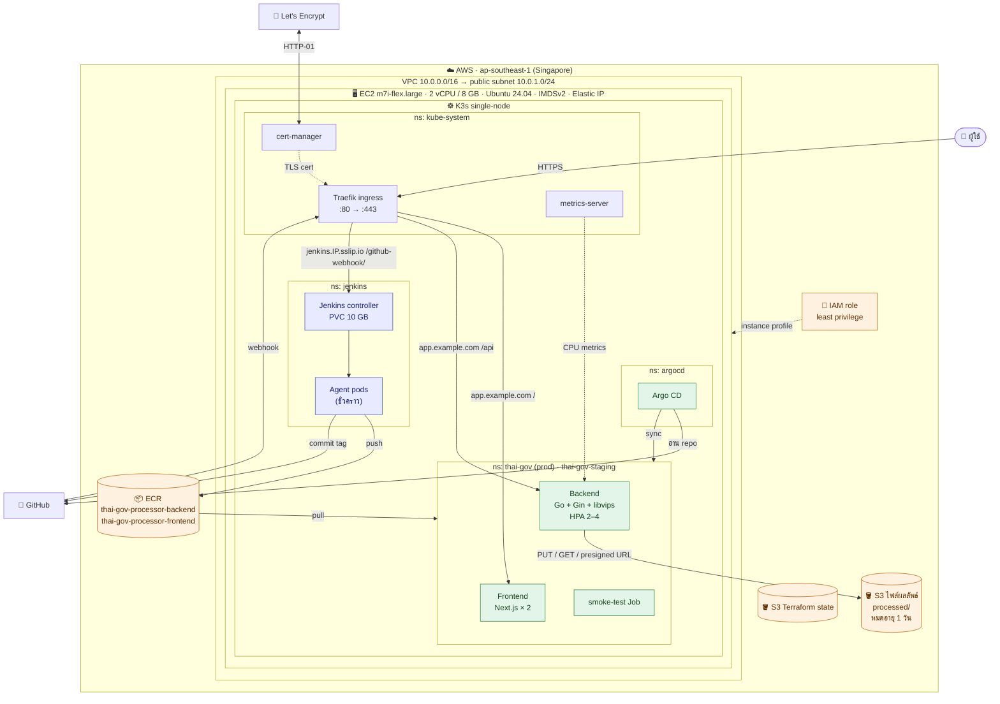
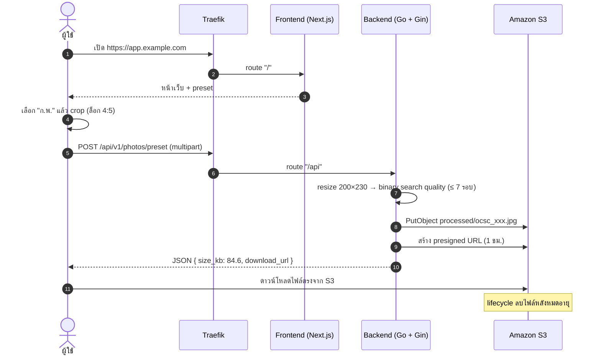

# Architecture

สองส่วนหลักของระบบคือ **Application layer** (Next.js + Go + S3) กับ **DevOps layer** (Terraform → K3s → Jenkins → Argo CD) แยกกันชัดเจน — layer แรกทำหน้าที่ประมวลผลไฟล์ ส่วนอีก layer ทำหน้าที่เอาโค้ดขึ้น production โดยอัตโนมัติ

ภาพรวมทั้งระบบอยู่ในไฟล์ [`Architecture diagram/Project CICD FUll.drawio-2.svg`](../Architecture%20diagram/Project%20CICD%20FUll.drawio-2.svg) ส่วนด้านล่างนี้คือ diagram แยกตาม tier ที่ตรงกับ implementation ปัจจุบัน (BuildKit แทน Kaniko, Argo CD แทน `kubectl rollout`, ไม่เปิด SSH, frontend/backend อยู่ namespace เดียวกับ Ingress)

## Diagram แยกตาม tier

## Runtime บน AWS

Region หลักคือ `ap-southeast-1` (Singapore) ทั้งระบบรันอยู่บน EC2 เครื่องเดียวที่ติดตั้ง K3s — ตั้งใจทำแบบ production-like เพื่อเรียนรู้ ไม่ใช่ high-availability production เต็มรูปแบบ

### เส้นทางของผู้ใช้ 1 คน

## หลักการแบ่งหน้าที่

- **Jenkins** ทำ CI เท่านั้น — ตรวจโค้ด, test, build, security scan แล้วหยุดแค่ commit เปลี่ยน image tag กลับเข้า Git ไม่มีสิทธิ์ deploy เข้า production โดยตรง
- **Argo CD** ทำ CD — อ่าน desired state จาก Git แล้ว sync เข้า K3s เอง (pull-based, ไม่ใช่ push-based)
- **Terraform** รับผิดชอบ infrastructure เท่านั้น (VPC, EC2, S3, ECR, IAM, Budgets) ไม่แตะ application deployment
- **Build ครั้งเดียว** บน `dev` แล้ว promote tag เดิมผ่าน `staging` ไป `main` (ดู [cicd-pipeline.md](cicd-pipeline.md))
- มี environment จริงสองตัวในเครื่องเดียว: `thai-gov` (prod, backend HPA 2–4) และ `thai-gov-staging` (1 replica ต่อ service ไม่มี HPA) `dev` ไม่มี environment ของตัวเอง

รายละเอียดของแต่ละส่วนดูได้ที่ [cicd-pipeline.md](cicd-pipeline.md) และ [infrastructure.md](infrastructure.md)
