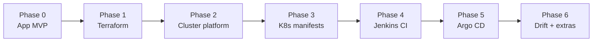

# Build Checklist

แต่ละข้อบอกว่าต้องทำอะไรได้, คำใบ้ และวิธีเช็คว่าทำถูก ทำเสร็จข้อไหนติ๊ก `[x]` ได้เลย ไฟล์นี้เป็นบันทึกความคืบหน้าของโปรเจกต์ไปในตัว

## Phase 0 · App MVP

ใช้เวลากับส่วนนี้ไม่เกิน 30% ของทั้งโปรเจกต์

- [x] **Backend: endpoint ครบ 5 ตัว** ได้แก่ `/healthz`, `/api/v1/presets`, `/api/v1/photos/preset`, `/api/v1/documents/merge-pdf`, `/api/v1/selftest`
  - คำใบ้: ใช้ Gin เป็น router (`gin.New()` + logger/recovery middleware เอง แทน `gin.Default()` เพราะ container รันแบบ read-only filesystem ไม่ต้องพึ่ง default logger ที่เขียนไฟล์)
  - คำใบ้: ทำ preset ก.พ. ให้ใช้ได้ก่อนตัวเดียว ตัวอื่นค่อยเพิ่มทีหลัง
  - เช็ค: ส่งรูป 3 MB เข้าไปแล้วได้ไฟล์ 200×230 ที่ ≤ 100 KB กลับมา — ✅ ทดสอบจริงกับรูป noise 5 MB ได้ 200×230 @ 39.3 KB, quality 95
  - เช็ค `merge-pdf`: ส่งรูป 2 ใบ + PDF เดิม 1 ไฟล์ (2 หน้า) เข้าไปพร้อมกัน ต้องได้ PDF เดียวที่มี 4 หน้าตามลำดับที่ส่ง — ✅ ทดสอบจริง ได้ 4 หน้าตามลำดับ (ตรวจสีแต่ละหน้ายืนยันลำดับ)
- [x] **Unit test ของ processor** อย่างน้อย 3 กรณี: รูปใหญ่, รูปเล็กอยู่แล้ว และรูปที่บีบให้ต่ำกว่าเกณฑ์ไม่ได้
  - เช็ค: test ผ่านเมื่อรันพร้อม race detector — ✅ `go test ./... -race` ผ่าน
- [x] **Unit test ของ merge-pdf** อย่างน้อย 2 กรณี: รวมเฉพาะรูป และรวมรูปผสมกับ PDF หลายหน้า
  - เช็ค: จำนวนหน้าและลำดับหน้าของผลลัพธ์ตรงกับไฟล์ที่ส่งเข้ามา — ✅
- [x] **Backend Dockerfile** แบบ multi-stage และ runtime รันด้วย user ที่ไม่ใช่ root
  - คำใบ้: bimg ใช้ cgo จึงต้องมี libvips แบบ dev ใน stage build และแบบ runtime ใน stage สุดท้าย
  - เช็ค: image สุดท้ายเล็กกว่า image ของ stage build อย่างเห็นได้ชัด และ `whoami` ใน container ไม่ใช่ root — ✅ 3.98 GB → 359 MB, `whoami` = `app`
- [x] **Frontend แบบเรียบง่าย** มีหน้า upload, ตัวเลือก preset และปุ่มดาวน์โหลด (cropper ค่อยเพิ่มทีหลัง)
  - คำใบ้: ให้เบราว์เซอร์เรียก `/api/...` ตรง ไม่ต้องทำ proxy route ใน Next.js เพราะ Ingress จะแยก path ให้ — local dev ไม่มี Ingress จึงใช้ `NEXT_PUBLIC_API_BASE_URL` แทน
- [x] **Docker Compose** รัน 3 service ได้แก่ frontend, backend และ MinIO — ✅ ผ่าน `docker compose up`, ทุก endpoint ตอบ 200

## Phase 1 · Terraform

- [x] **Remote state** เก็บบน S3 เปิด encrypt และ `use_lockfile`
- [x] **Network**: VPC, public subnet, Internet Gateway และ route table
- [x] **Security group**: เปิด 80/443 ให้ทุกที่, 6443 เฉพาะ IP ตัวเอง, ไม่เปิด 22
- [x] **IAM**: role + instance profile ที่ให้สิทธิ์เฉพาะ ECR 2 repo, S3 bucket เดียว และ SSM
  - คำใบ้: `ecr:GetAuthorizationToken` ต้องใช้ resource `*` ส่วน action อื่นให้จำกัดเฉพาะ ARN ของ repo
  - ✅ ตรวจ policy จริงจาก `aws iam get-role-policy` แล้ว ตรงตามคำใบ้เป๊ะ
- [x] **EC2**: หา AMI ด้วย data source แทนการเขียน ID ตายตัว, บังคับ IMDSv2, เข้ารหัส EBS, ใช้ Elastic IP
  - คำใบ้: ตั้ง hop limit ของ metadata เป็น 2 ไม่อย่างนั้น pod จะใช้ IAM role ของเครื่องไม่ได้
  - คำใบ้: ส่ง IP ของ Elastic IP เข้าไปใน user_data ผ่าน template ไม่ต้องไปอ่านจาก metadata ตอนบูต
  - หมายเหตุ: บัญชี AWS นี้ติด restriction ใหม่ (Free Tier only) ชั่วคราว ใช้ `t3.micro` ผ่าน `terraform.tfvars` override แทน `t3a.large` ไปก่อน (ดู `variables.tf`) — สลับกลับได้ทันทีที่ AWS ปลดล็อก
- [x] **ECR**: 2 repo แบบ IMMUTABLE, scan on push และ lifecycle policy เก็บ 10 image ล่าสุด
- [x] **S3 ไฟล์ผู้ใช้**: block public access, SSE, lifecycle หมดอายุ 1 วัน และลบ multipart upload ที่ค้าง
- [x] **Outputs**: instance id, public IP, ชื่อ bucket และ URL ของ ECR
- เช็คทั้ง phase: `terraform fmt -check` และ `validate` ผ่าน, apply แล้ว plan ซ้ำต้องขึ้น *No changes*, destroy แล้ว apply ใหม่ต้องได้ระบบเดิม — ✅ ทดสอบจริงครบ: apply (26 resources) → plan ซ้ำ *No changes* → destroy (26 destroyed) → apply ใหม่ (26 added) → plan ซ้ำ *No changes* อีกรอบ

## Phase 2 · Cluster platform

- [x] **K3s** ติดตั้งผ่าน user_data ใส่ Elastic IP ไว้ใน TLS SAN
  - เช็ค: ใช้ `kubectl` จากเครื่องตัวเองผ่าน port 6443 ได้ และจาก IP อื่นเข้าไม่ได้ — ✅ ทดสอบจริง: `kubectl get nodes` จากเครื่องตัวเองได้ `Ready` (v1.36.4+k3s1) โดย TLS ผ่านไม่ต้อง `--insecure`, ส่วน hotspot มือถือ `curl` ไป 6443 ได้ timeout
  - หมายเหตุ: `t3.micro` (RAM 1 GB) ใช้ไป ~795 MB แค่ K3s อย่างเดียว ต้องเพิ่มขนาดเครื่องก่อนติดตั้ง cert-manager/Argo CD/Jenkins
- [x] **ecr-credential-provider**
  - คำใบ้: K3s หา binary และ config ของ credential provider ใน `/var/lib/rancher/credentialprovider/` เป็นค่าเริ่มต้น
  - เช็ค: pod ยังดึง image จาก ECR ได้หลังผ่านไปเกิน 12 ชม.
  - ✅ ทดสอบจริง: ตอนที่ node อายุ ~13 ชม. (เกิน 12 ชม. ที่ token ECR หมดอายุ และ node ไม่เคยรีสตาร์ต) pod ใหม่ที่ `imagePullPolicy: Always` และไม่มี `imagePullSecrets` ดึง `credtest-1` ได้ `Successfully pulled` ใน 546ms
- [x] **cert-manager + ClusterIssuer** ของ Let's Encrypt แบบ HTTP-01
  - คำใบ้: ทดสอบกับ staging issuer ก่อน เพื่อไม่ให้ชน rate limit
  - เช็ค: เบราว์เซอร์ขึ้นแม่กุญแจ และ cert ออกโดย Let's Encrypt
  - ✅ ทดสอบจริงด้วย nginx + Ingress ชั่วคราวที่ `app.52-74-96-78.sslip.io`: staging ออก cert ได้ใน ~30 วิ, สลับเป็น prod ได้ cert issuer `Let's Encrypt CN=YR1` และ `curl` ไม่ใช้ `-k` ได้ 200 (`ssl_verify=0`)
  - หมายเหตุ: ใช้ sslip.io ระหว่างที่ยังไม่มีโดเมนจริง, ไม่ใส่ email ใน ClusterIssuer (cert-manager ต่ออายุเองอยู่แล้ว)
- [x] **Argo CD** ติดตั้งและเข้า UI ได้
  - ✅ ทดสอบจริง: v3.5.3 ทุก pod (7 ตัว) Running, เข้า UI ผ่าน `kubectl port-forward` ได้ 200 และ login admin ผ่านทาง API สำเร็จ (ยังไม่เปิด Ingress สาธารณะ ตั้งใจไว้ก่อน)
- [x] **Jenkins** ติดตั้งด้วย Helm ตั้ง resource limit ของ controller, PVC 10 GB และติดตั้ง plugin ที่ต้องใช้ (Kubernetes, GitHub Branch Source, Credentials Binding, SCM Skip, Workspace Cleanup)
  - ✅ ทดสอบจริง: chart 5.9.64 (Jenkins 2.568.3), controller limit 1 CPU / 2 GiB, PVC 10 GiB (local-path) Bound, plugin ครบ 5 ตัว active (pin เวอร์ชันแล้ว) ไม่มี plugin ล้มเหลว, `numExecutors: 0` (build รันใน agent pod เท่านั้น), login admin ผ่านทาง API — เข้าผ่าน `kubectl port-forward` ก่อน ยังไม่เปิด Ingress จนกว่าจะตั้ง webhook

## Phase 3 · Kubernetes manifests (Kustomize)

- [x] **Deployment ของ backend และ frontend**
  - readinessProbe และ livenessProbe ที่ `/healthz`
  - rolling update แบบ `maxSurge: 1` / `maxUnavailable: 0`
  - รันแบบ non-root, root filesystem เป็น read-only (mount `/tmp` เป็น emptyDir), drop capabilities ทั้งหมด
  - กำหนด resource requests และ limits
- [x] **Service** แบบ ClusterIP ของทั้งสองตัว
- [x] **HPA** ของ backend 2–4 pods ที่ CPU 70%
- [x] **Ingress** อยู่ namespace เดียวกับ service, `/` ไป frontend, `/api` ไป backend, มี TLS จาก cert-manager
- [x] **Smoke test Job** เป็น PostSync hook ของ Argo CD เรียก `/healthz` และ `/api/v1/selftest`
- [x] **Overlay `prod`** กำหนด namespace และช่อง `images` (`newName` / `newTag`) ให้ Jenkins มาแก้ tag ที่นี่
- เช็คทั้ง phase: ลบ pod backend ทิ้ง 1 ตัวระหว่างยิง request ต่อเนื่อง ต้องไม่มี request ที่ error
  - ✅ ทดสอบจริงด้วย image ที่ build/push มือ (`manual-e536a69`): ยิง `/api/v1/presets` ผ่าน Ingress 300 ครั้ง ลบ backend 1 ตัวกลางทาง ได้ 200 ครบ 300/300, smoke test Job ผ่านทั้ง `/healthz` และ `/api/v1/selftest`, cert-manager ออก cert (staging) ได้ และ `/` กับ `/api` ตอบ 200
  - หมายเหตุ: รอบแรกที่ลบ pod พลาด (คำสั่งลบเกิน) เจอ 502 หนึ่งครั้งจาก 300 ยังไม่ได้พิสูจน์ว่าเป็น race ตอน pod กำลังปิด จึงควรพิจารณาเพิ่ม `preStop` sleep ถ้าเจออีก

## Phase 4 · Jenkins CI

- [ ] **Agent pod spec** มี container แยกตามงาน: tools, golang, node, buildkit (rootless), trivy, terraform, aws-cli และ crane
  - คำใบ้: BuildKit แบบ rootless ใน pod ต้องตั้ง seccomp และ AppArmor เป็น Unconfined
  - คำใบ้: pin เวอร์ชันของทุก image ห้ามใช้ `latest`
- [ ] **Pipeline สำหรับ PR**: lint → test → build เป็นไฟล์ `.tar` → Trivy gate → terraform plan (เฉพาะเมื่อแก้ `iac/`)
- [ ] **Pipeline สำหรับ main**: build → Trivy gate → push ไฟล์ `.tar` ตัวที่สแกนแล้วขึ้น ECR → แก้ tag ใน overlay → commit กลับ
  - คำใบ้: ใช้เงื่อนไข `when` แยกขั้นที่รันเฉพาะ PR กับเฉพาะ main
  - คำใบ้: ขอ token ของ ECR ด้วย IAM role แล้วเขียน docker config เอง ไม่ต้องเก็บ access key
- [ ] **กันการวนลูป**: commit ที่ Jenkins สร้างเองต้องไม่ trigger pipeline ซ้ำ
- [ ] **แจ้งเตือน** Discord ทั้งตอนผ่านและตอนล้มเหลว
- เช็คทั้ง phase:
  - เปิด PR ที่ใส่ dependency ที่มีช่องโหว่ CRITICAL → PR ต้องขึ้น ✘ และกด Merge ไม่ได้
  - merge PR ปกติ → มี image tag ใหม่ใน ECR และมี commit แก้ tag ใน Git

## Phase 5 · Argo CD

- [ ] **Application** ชี้ไปที่ overlay `prod` เปิด auto sync, prune และ self-heal
- [ ] **Notifications** ส่งเข้า Discord ตอน deployed และตอน sync failed
- เช็คทั้ง phase:
  - `kubectl edit` เปลี่ยน replicas ด้วยมือ → Argo ต้องแก้กลับเอง
  - `git revert` commit ที่แก้ tag → เว็บต้องกลับไปเป็นเวอร์ชันเดิม

## Phase 6 · Drift detect และของเสริม

- [ ] **Jenkins job ทุกคืน 02:00 (เวลาไทย)** รัน terraform plan แบบ detailed exit code ถ้าเจอ drift ให้แจ้ง Discord
  - เช็ค: ไปแก้ security group ใน console ด้วยมือ → คืนนั้นต้องมีแจ้งเตือน
- [ ] **AWS Budgets** แจ้งเตือนเมื่อเกิน $10/เดือน
- [ ] **Screenshot และวิดีโอ** สำหรับ [lessons-learned.md](lessons-learned.md)

## จุดที่มักพลาด

| อาการ | สาเหตุที่พบบ่อย |
| --- | --- |
| pod ขึ้น `ImagePullBackOff` หลังผ่านไปครึ่งวัน | token ของ ECR หมดอายุ (12 ชม.) และไม่มี credential provider |
| pod เรียก AWS แล้วได้ access denied ทั้งที่ role ถูกต้อง | hop limit ของ IMDSv2 ยังเป็น 1 |
| Ingress ส่ง 404 ไปที่ frontend | service อยู่คนละ namespace กับ Ingress |
| pipeline วนรันไม่จบ | commit ที่ Jenkins แก้ tag trigger ตัวเองซ้ำ |
| BuildKit ใน pod error เรื่อง permission | ไม่ได้ตั้ง seccomp/AppArmor เป็น Unconfined หรือ user ไม่ตรงกับเจ้าของ workspace |
| `go test` fail ใน CI แต่ผ่านบนเครื่อง | container ใน CI ไม่มี libvips สำหรับ cgo |
| Trivy เจอช่องโหว่แต่ pipeline ยังผ่าน | ตั้ง exit code เป็น 0 |
| ไฟล์ใน S3 ยังอยู่เกิน 24 ชม. | lifecycle ปัดไปเที่ยงคืน UTC และลบแบบ async (เป็นพฤติกรรมปกติ) |
