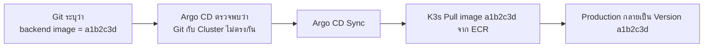
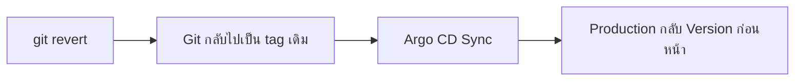
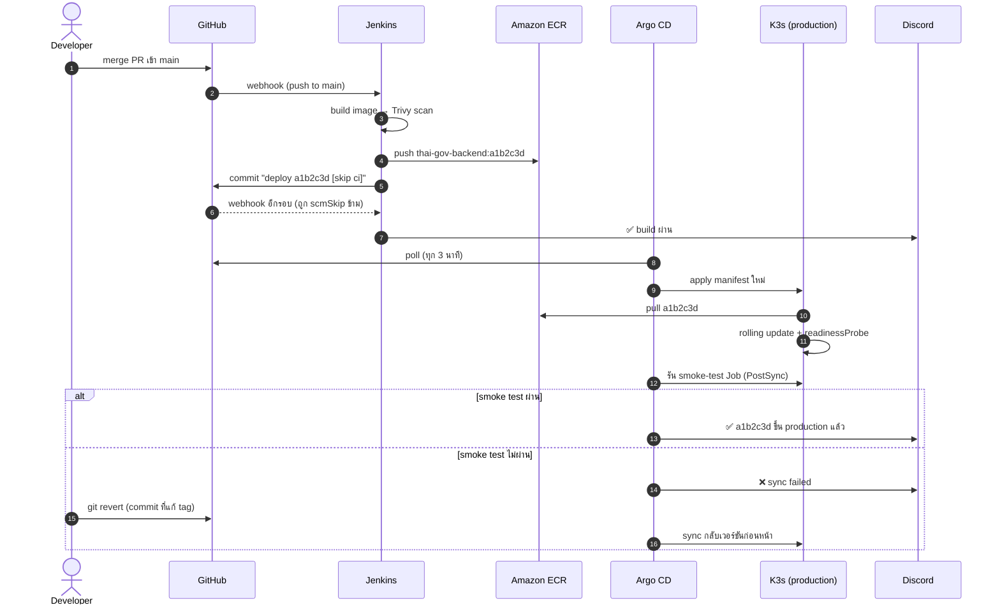
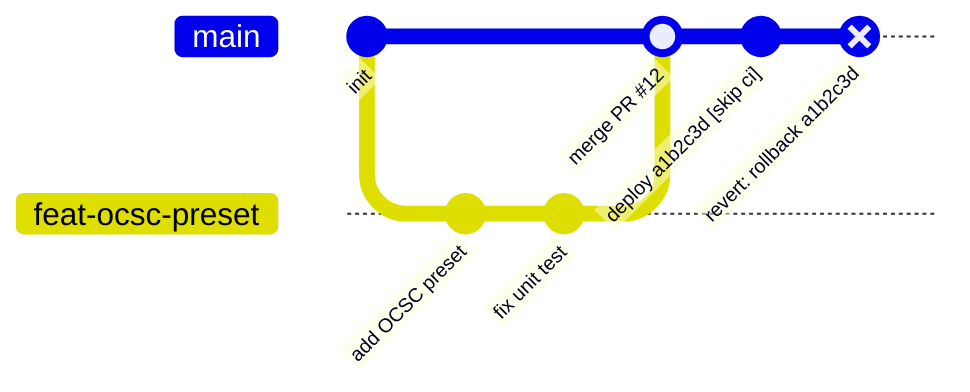

# CI/CD Pipeline

นี่คือส่วนที่โปรเจกต์นี้ให้ความสำคัญมากที่สุด ทุกอย่างที่ deploy เข้า production ต้องผ่าน pipeline นี้ก่อน ไม่มีการ SSH เข้าเครื่องแล้วแก้ไฟล์ตรงๆ

## ภาพรวม 4 เลน

```mermaid
flowchart TB
    subgraph L1["① Developer & GitHub"]
        direction LR
        a1["สร้าง branch<br/>feat/*"] --> a2["commit & push"] --> a3["เปิด Pull Request<br/>(branch protection)"] --> a4["GitHub webhook<br/>ลงนามด้วย HMAC secret"]
    end

    subgraph L2["② CI · PR pipeline (ตรวจอย่างเดียว ไม่ deploy)"]
        direction LR
        b1["Checkout"] --> b2["Lint<br/>go vet · golangci-lint<br/>eslint · tsc"] --> b3["Unit test<br/>go test -race -cover<br/>npm test"] --> b4["Build image<br/>BuildKit → .tar<br/>(ยังไม่ push)"] --> b5{{"🛡️ Trivy gate<br/>CRITICAL = fail"}} --> b6["Terraform<br/>fmt · validate · plan<br/>(ถ้าแก้ iac/)"] --> b7["ส่งสถานะ ✔/✘<br/>กลับไปที่ PR"]
    end

    subgraph L3["③ CI · main pipeline (build ของจริง)"]
        direction LR
        c1["Build image<br/>tag = git SHA"] --> c2{{"🛡️ Trivy gate<br/>สแกนซ้ำ"}} --> c3["Push ECR<br/>(IMMUTABLE)"] --> c4["แก้ tag ใน<br/>kustomization.yaml<br/>commit [skip ci]"] --> c5["แจ้ง Discord"]
    end

    subgraph L4["④ CD · Argo CD (GitOps)"]
        direction LR
        d1["ตรวจเจอ commit ใหม่<br/>(poll 3 นาที)"] --> d2["Sync เข้า<br/>ns: production"] --> d3["Rolling update<br/>maxUnavailable 0<br/>readinessProbe"] --> d4{{"🧪 Smoke test<br/>PostSync Job"}} --> d5["✅ แจ้งผล / ❌ git revert"]
    end

    a4 --> b1
    b7 --> rv["👀 Code review + Merge"]
    rv --> c1
    c5 --> d1

    classDef gate fill:#fde4e4,stroke:#b83030,color:#5c1414
    classDef pr fill:#e8ebff,stroke:#3f4fc2,color:#1b2270
    classDef main fill:#dff3f4,stroke:#0a7580,color:#053b40
    classDef cd fill:#e3f4e8,stroke:#2b7f43,color:#14401f
    class b1,b2,b3,b4,b6,b7 pr
    class c1,c3,c4,c5 main
    class d1,d2,d3,d5 cd
    class b5,c2,d4 gate
```

กล่องหกเหลี่ยมสีแดงคือด่านตรวจ ถ้าไม่ผ่าน pipeline จะหยุดตรงนั้น

## แต่ละขั้นทำอะไร

| เลน | ขั้น | ทำอะไร | Tool | ถ้าไม่ผ่าน |
| --- | --- | --- | --- | --- |
| ② PR | Checkout | ดึงโค้ดของ PR เข้า agent pod | Jenkins, git | – |
| ② PR | Lint | ตรวจรูปแบบโค้ดและ type error | `go vet`, golangci-lint, eslint, `tsc --noEmit` | หยุด ✘ |
| ② PR | Unit test | ทดสอบ logic เช่น ไฟล์ออกมาต้อง ≤ 100 KB และขนาด 200×230 จริง | `go test -race -cover`, `npm test` | หยุด ✘ |
| ② PR | Build image | ลอง build ให้แน่ใจว่า Dockerfile ใช้ได้ ผลลัพธ์เก็บเป็น `.tar` | BuildKit (rootless) | หยุด ✘ |
| ② PR | Security gate | สแกนช่องโหว่ของ dependency, OS package และ secret ที่หลุดเข้าโค้ด | `trivy fs`, `trivy image --input` | บล็อก PR |
| ② PR | Terraform | `fmt -check`, `validate`, `plan` ด้วย role แบบ read-only | Terraform | หยุด ✘ |
| ② PR | Status | ส่ง ✔/✘ เป็น required status check ของ GitHub | GitHub Branch Source | ปุ่ม Merge ถูกล็อก |
| ③ main | Build | build backend และ frontend ติด tag `a1b2c3d` (git SHA) | BuildKit | หยุด |
| ③ main | Security gate | สแกน image ตัวสุดท้ายซ้ำ เผื่อมี CVE ใหม่ประกาศหลัง PR ผ่าน | Trivy | ไม่ push |
| ③ main | Push | push ไฟล์ `.tar` ตัวเดียวกับที่สแกนแล้วขึ้น ECR | crane, IAM role | หยุด |
| ③ main | Update manifest | แก้ `newTag` ใน `k8s/overlays/prod/kustomization.yaml` แล้ว commit กลับ | yq, git | หยุด |
| ④ CD | Detect | Argo CD เห็นว่า Git ไม่ตรงกับ cluster | Argo CD | – |
| ④ CD | Sync | apply manifest, self-heal ถ้ามีคนแก้ใน cluster ด้วยมือ | Argo CD | สถานะ OutOfSync |
| ④ CD | Rolling update | สร้าง pod ใหม่ให้ ready ก่อน แล้วค่อยลบ pod เก่า | Deployment, readinessProbe | pod เก่ายังรับ traffic ต่อ |
| ④ CD | Smoke test | Job เรียก `/healthz` และ `/api/v1/selftest` (แปลงรูปตัวอย่างจริง) | PostSync hook | sync = Failed → แจ้ง ❌ |
| ④ CD | Rollback | `git revert` commit ที่แก้ tag แล้ว Argo sync กลับเวอร์ชันเดิม | git, Argo CD | – |

> Build image ทำครั้งเดียวในเลน ③ แล้ว push ไฟล์ `.tar` ตัวที่ผ่าน Trivy ไปตรงๆ ไม่ build ซ้ำตอน push — กัน image ที่ขึ้น production เป็นคนละตัวกับที่สแกนผ่าน

## GitOps: ทำไม Argo CD ถึงเป็นคนตัดสินใจ deploy

Git คือ source of truth ของ production เสมอ Jenkins ไม่มีสิทธิ์เขียนเข้า cluster เลย มันแค่ commit image tag ใหม่กลับเข้า repo ส่วน Argo CD จะ poll repo แล้วเทียบกับสถานะจริงใน cluster ถ้าไม่ตรงกันถึงจะ sync

Rollback ก็ทำผ่าน Git เหมือนกัน ไม่ต้องเข้า cluster:

ข้อดีของแนวทางนี้: ทุก deploy และ rollback ตรวจสอบย้อนหลังได้จาก `git log` ล้วนๆ ไม่ต้องพึ่ง audit log ของ CI หรือ cluster เพิ่ม

## Deploy 1 ครั้งเกิดอะไรขึ้นบ้าง

## ประวัติ Git ที่เกิดขึ้นจริง

## เหตุการณ์ไหนทำให้อะไรรัน

| เหตุการณ์ | สิ่งที่รัน | ขึ้นเว็บจริงไหม |
| --- | --- | --- |
| push เข้า feature branch ที่ยังไม่เปิด PR | ไม่รันอะไร | ไม่ |
| เปิด PR หรือ push เพิ่มเข้า PR | เลน ② (+ terraform plan ถ้าแก้ `iac/`) | ไม่ |
| merge เข้า `main` | เลน ③ ต่อด้วยเลน ④ | ใช่ ภายในไม่กี่นาที |
| commit ที่มี `[skip ci]` (Jenkins อัปเดต tag) | Jenkins ข้าม, Argo CD sync | ใช่ |
| `git revert` บน `main` | Argo CD sync กลับเวอร์ชันเดิม | ใช่ = rollback |
| ทุกคืน 02:00 | Terraform drift detect | ไม่ (แจ้งเตือนอย่างเดียว) |
| สั่ง `terraform apply` จากเครื่อง | เปลี่ยน infrastructure | เปลี่ยน infra |

> Argo CD ไม่ rollback ให้เองเมื่อ smoke test ไม่ผ่าน มันจะแจ้งว่า sync failed แล้วต้อง `git revert` เอง ระหว่าง rolling update ถ้า pod ใหม่ไม่ ready ตัว Deployment จะไม่ลบ pod เก่า เว็บจึงไม่ล่ม
