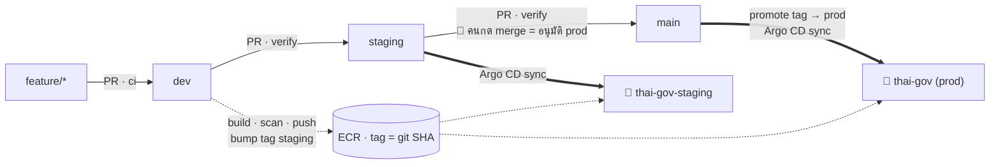
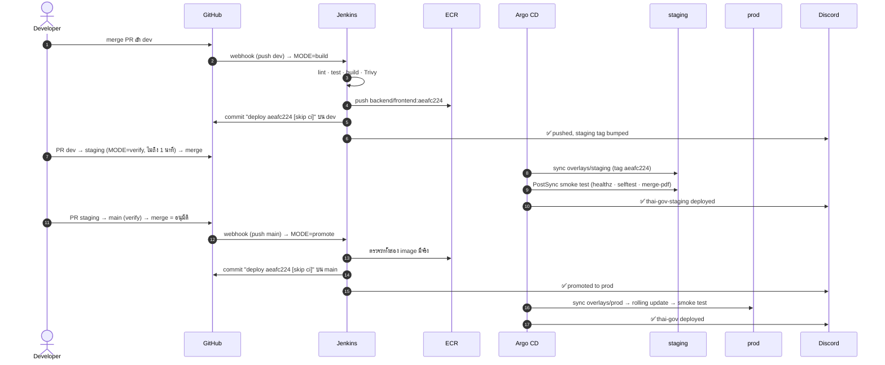

# CI/CD Pipeline

ทุกอย่างที่ขึ้น production ผ่าน pipeline นี้ ไม่มีการ SSH เข้าเครื่องแล้วแก้ไฟล์ตรงๆ หลักคิด:

1. **Jenkins ทำ CI เท่านั้น** ตรวจ, build, scan, push image แล้วเขียน tag ลง Git ไม่มีสิทธิ์เข้า cluster
2. **Argo CD ทำ CD** อ่าน Git แล้ว sync เข้า cluster เอง (pull-based)
3. **Build ครั้งเดียว** บน `dev` ส่วน staging และ prod แค่ย้าย tag ของ image ตัวเดิม

## ภาพรวม



| Branch | บทบาท | environment |
| --- | --- | --- |
| `feature/*` | งานแต่ละชิ้น (PR เข้า `dev`) | ไม่มี |
| `dev` | integration: build + scan + push image ที่นี่ที่เดียว | ไม่มี (เครื่องมี 2 vCPU ไม่พอสำหรับ environment ที่สาม) |
| `staging` | ลองของที่ build แล้วก่อนขึ้นจริง | `thai-gov-staging` · `staging.<ip>.sslip.io` |
| `main` | production | `thai-gov` · `app.<ip>.sslip.io` |

## Jenkinsfile: 5 โหมด

`Classify` เป็น stage แรก อ่าน branch / PR / commit บนสุด แล้วตั้ง `env.MODE` (เห็นเป็นบรรทัด `MODE=…` ใน console)

| เหตุการณ์ | MODE | ทำอะไร |
| --- | --- | --- |
| PR จาก feature เข้า `dev` | `ci` | lint → test → build `.tar` → Trivy gate → terraform plan (ถ้าแก้ `iac/`) |
| PR `dev → staging` หรือ `staging → main` | `verify` | ตรวจว่า image ของ tag ที่ promote มีใน ECR ทั้ง backend และ frontend |
| PR ที่แก้แต่ `docs/**` หรือ `*.md` | `skip` | รายงานผ่านโดยไม่ build |
| push เข้า `dev` | `build` | CI เต็ม → push `.tar` ที่ scan แล้วขึ้น ECR → bump tag ใน `overlays/staging` บน `dev` |
| push เข้า `staging` | `verify` | tag มากับ merge แล้ว ตรวจ ECR เฉยๆ |
| push เข้า `main` | `promote` | คัดลอก tag staging → `overlays/prod` เฉพาะเมื่อ merge นี้เปลี่ยนไฟล์ staging overlay |
| commit บนสุดมี `[skip ci]` (บอท) | `skip` | ข้าม (ไม่ใช้กับ PR) |

| Stage | `ci` | `build` | `verify` | `promote` |
| --- | :-: | :-: | :-: | :-: |
| Classify | ✓ | ✓ | ✓ | ✓ |
| CI: Prepare · Lint · Test · Build images · Trivy gate | ✓ | ✓ | | |
| CI: Terraform plan (เฉพาะ PR ที่แก้ `iac/`) | ✓ | | | |
| Push to ECR | | ✓ | | |
| Bump staging tag | | ✓ | | |
| Verify promoted image | | | ✓ | ✓ |
| Promote to prod | | | | ✓ |

### Stage ใน CI

| Stage | ทำอะไร | Tool |
| --- | --- | --- |
| Prepare | ติดตั้ง libvips และ golangci-lint (bimg ใช้ cgo ทุกขั้นที่ compile ต้องมี header) | apt, golangci-lint v1.64.8 |
| Lint (ขนาน) | backend: `gofmt`, `go vet`, golangci-lint · frontend: `next lint`, `tsc --noEmit` | golang, node |
| Test | `go test -race -cover ./...` | golang |
| Build images | build backend และ frontend เป็นไฟล์ `.tar` (ยังไม่ push) | BuildKit rootless |
| Trivy gate | สแกนซอร์ส+secret และ image ทั้งสองไฟล์ ช่องโหว่ CRITICAL ที่มีแพตช์ → ล้ม (`--severity CRITICAL --ignore-unfixed --exit-code 1`) | Trivy |
| Terraform plan | `fmt -check`, `validate`, `plan -lock=false` ด้วย user `tf-readonly` | Terraform |
| Push to ECR | ขอ token ด้วย IAM role แล้วเขียน docker config เอง `crane push` ไฟล์ `.tar` **ตัวที่สแกนแล้ว** (ถ้า tag มีอยู่แล้วข้าม) | aws-cli, crane |
| Bump staging tag | `sed` แก้ `newTag` (2 ที่) ใน `overlays/staging/kustomization.yaml` แล้ว commit `deploy <tag> [skip ci]` | git |

Agent pod: `ci/agent-pod.yaml` มี 9 container (jnlp, tools, golang, node, buildkit, trivy, terraform, aws-cli, crane) pin เวอร์ชันทุกตัว สร้างตอน build แล้วลบทิ้ง Jenkins รันได้ทีละ agent (`containerCap: 1`)

## Tag เดินทางอย่างไร



commit `deploy … [skip ci]` ที่บอทสร้างทำให้เกิด webhook อีกรอบ Jenkins อ่าน commit บนสุดเจอ `[skip ci]` จึงตั้ง `MODE=skip` กันวนลูป

## กฎและด่าน

| ด่าน | วิธีบังคับ |
| --- | --- |
| ต้องผ่าน PR และเช็ค `continuous-integration/jenkins/pr-merge` | GitHub rulesets `protect-dev`, `protect-staging`, `protect-main` |
| merge ได้แบบ merge commit อย่างเดียว | `allowed_merge_methods: ["merge"]` squash ทำให้ประวัติเพี้ยนและชนกันทุกครั้งที่ promote |
| PR เข้า `staging` ต้องมาจาก `dev`, เข้า `main` ต้องมาจาก `staging` | `Classify` ทำให้เช็คล้ม → PR BLOCKED (ruleset บังคับ branch ต้นทางไม่ได้) |
| ห้ามลบ / force push | rulesets |
| บอท Jenkins push commit `deploy … [skip ci]` ได้ | admin bypass ใน rulesets (PAT ของ admin) |

## CD: Argo CD

| Application | ติดตาม | ปลายทาง | policy |
| --- | --- | --- | --- |
| `thai-gov` | `main` · `k8s/overlays/prod` | ns `thai-gov` | auto sync · prune · self-heal · backend HPA 2–4 pod |
| `thai-gov-staging` | `staging` · `k8s/overlays/staging` | ns `thai-gov-staging` | เหมือนกัน แต่ 1 replica ไม่มี HPA |

- Argo CD ตรวจ Git ทุก ~3 นาที (สั่งทันทีด้วย annotation `argocd.argoproj.io/refresh=hard`) repo เป็น public จึงไม่ต้องมี credential
- **Rolling update** `maxSurge: 1`, `maxUnavailable: 0` + readinessProbe `/healthz`
- **PostSync smoke test** (Job ใน `k8s/base`): เรียก `/healthz`, `/api/v1/selftest` และอัปโหลด PNG เข้า `merge-pdf` ล้มเมื่อไรคือ sync ล้ม
- **Self-heal:** แก้ของใน cluster ด้วยมือ Argo ดึงกลับให้ตรง Git
- **Notifications** (Discord): `on-deployed` และ `on-sync-failed` ส่งครั้งเดียวต่อ revision (`oncePer`)
- Argo CD ไม่ rollback ให้เองเมื่อ smoke test ล้ม แต่ pod เก่ายังรับ traffic ต่อเพราะ rolling update ไม่ลบตัวเก่าจนกว่าตัวใหม่จะ ready

## Rollback

```bash
git checkout main && git pull
git revert --no-commit <sha ของ commit "deploy <tag> [skip ci]" ล่าสุด>
git commit -m "Revert deploy <tag> [skip ci]"
git push origin main            # ต้องใช้สิทธิ์ admin bypass
```

- **ต้องมี `[skip ci]`** ไม่งั้น Jenkins รัน `promote` ซ้ำจาก merge ล่าสุดแล้วเดินหน้าทับ (promote จึงทำงานเฉพาะเมื่อ merge เปลี่ยน tag ของ staging)
- Argo เห็นภายใน ~3 นาที ถ้า revert กลับ (revert ของ revert) เร็วกว่านั้น Argo จะไม่ทันเห็นการเปลี่ยนแปลงเลย รอให้ pod เปลี่ยนก่อนแล้วค่อยย้อนกลับ
- ทดสอบจริง: `dade6694 → 4c026658` และกลับ, pod ไม่ restart, smoke test ผ่าน

## Infrastructure drift

Jenkins job `terraform-drift` (`ci/drift.Jenkinsfile`, สร้างจาก JCasC) รันทุกคืน **02:00 เวลาไทย** (`TZ=Asia/Bangkok` เพราะ controller เป็น UTC): `terraform plan -detailed-exitcode -lock=false` ด้วย `tf-readonly` + `tf-admin-cidr` ชุดเดียวกับ PR plan

| exit code | ความหมาย | ผล |
| --- | --- | --- |
| 0 | ตรงกับโค้ด | เขียว เงียบ |
| 2 | มีคนแก้ AWS ด้วยมือ หรือโค้ดยังไม่ถูก `apply` | UNSTABLE + Discord ⚠️ |
| 1 | ตัวตรวจพัง | FAILURE + Discord ❌ |

## เหตุการณ์ไหนทำให้อะไรรัน

| เหตุการณ์ | สิ่งที่รัน | ถึง prod ไหม |
| --- | --- | --- |
| push feature branch ที่ยังไม่เปิด PR | ไม่รันอะไร | ไม่ |
| เปิด PR / push เพิ่มเข้า PR | `ci` / `verify` / `skip` ตามชนิด PR | ไม่ |
| merge เข้า `dev` | `build` | ไม่ (ไป staging ต้องเปิด PR) |
| merge เข้า `staging` | `verify` + Argo sync staging | ไม่ |
| merge เข้า `main` | `promote` + Argo sync prod | ใช่ ภายในไม่กี่นาที |
| commit `[skip ci]` ของบอท | `skip` (Argo sync ตามปกติ) | ตามไฟล์ที่เปลี่ยน |
| `git revert` บน `main` พร้อม `[skip ci]` | Argo sync กลับเวอร์ชันเดิม | ใช่ = rollback |
| ทุกคืน 02:00 | drift check | ไม่ (แจ้งเตือนอย่างเดียว) |

## ทำไมออกแบบแบบนี้

| การตัดสินใจ | เหตุผล |
| --- | --- |
| push ไฟล์ `.tar` ที่ scan แล้วด้วย `crane` ไม่ build ซ้ำ | ของที่ scan = ของที่ขึ้นจริง |
| tag = git SHA 8 ตัว, ECR IMMUTABLE | ย้อนรอยได้ว่า pod รันโค้ดไหน และไม่ถูกเขียนทับ |
| Jenkins เขียน tag ลง Git แทนที่จะสั่ง deploy | Git เป็นแหล่งความจริงเดียว ตรวจย้อนหลังด้วย `git log` |
| `promote` อ่าน tag จาก staging overlay ไม่ใช้ git SHA ของ merge | merge commit ไม่ใช่ SHA ที่ build ไว้ |
| อ่านข้อความ commit บนสุดเอง ไม่ใช้ `scmSkip` | `scmSkip` อ่านจาก changelog ซึ่งหลัง merge หลายครั้งมี commit ของฟีเจอร์ปน บอทเลยหลุดไป build |
| ข้าม "แก้แต่เอกสาร" เฉพาะ PR | build บน branch เช็ค `HEAD^1` ซึ่งหลัง Jenkins รวมหลาย merge อาจเห็นแค่ merge สุดท้ายแล้วซ่อนโค้ดของ merge ก่อน |
| merge commit อย่างเดียว | squash/rebase เขียนประวัติใหม่ ทำให้ promote ครั้งถัดไปชนกัน |
| frontend เรียก `/api` แบบ same-origin | image เดียวใช้ได้ทั้ง staging และ prod (เดิมฝัง URL ตอน build) |
