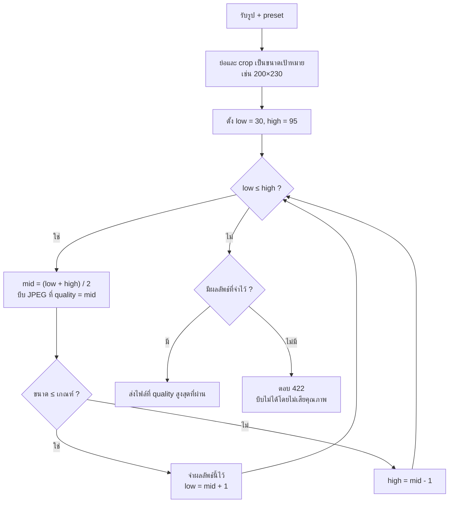

# Backend: อัลกอริทึมบีบไฟล์

โจทย์คือหาค่า JPEG quality ที่สูงที่สุด (ภาพชัดที่สุด) ซึ่งทำให้ไฟล์ยังไม่เกินเกณฑ์ เช่น 100 KB

ยิ่ง quality สูง ไฟล์ยิ่งใหญ่ จึงใช้ binary search ในช่วง quality 30–95 ได้ แต่ละรอบลองค่ากลาง ถ้าไฟล์ไม่เกินเกณฑ์ให้จำค่านั้นไว้แล้วลองค่าที่สูงขึ้น ถ้าเกินให้ลองค่าที่ต่ำลง ช่วงนี้มี 66 ค่า จึงใช้ไม่เกิน 7 รอบ (log₂66 ≈ 6.04) แทนการลองไล่ทีละค่า

## ตัวอย่าง (ตัวเลขขนาดไฟล์เป็นค่าสมมติ) เกณฑ์ 100 KB

| รอบ | low–high | ลอง quality | ขนาดไฟล์ | ผล |
| --- | --- | --- | --- | --- |
| 1 | 30–95 | 62 | 71 KB | ผ่าน → ลองสูงขึ้น |
| 2 | 63–95 | 79 | 92 KB | ผ่าน → ลองสูงขึ้น |
| 3 | 80–95 | 87 | 118 KB | เกิน → ลองต่ำลง |
| 4 | 80–86 | 83 | 104 KB | เกิน → ลองต่ำลง |
| 5 | 80–82 | 81 | 97 KB | ผ่าน → ลองสูงขึ้น |
| 6 | 82–82 | 82 | 101 KB | เกิน → จบ |

ได้คำตอบ quality 81 (97 KB) ใช้ 6 รอบ

## สิ่งที่ควรทำเพิ่ม

- ลบ metadata (EXIF) ออกก่อนบีบ ช่วยลดขนาดไฟล์และลบข้อมูลส่วนตัว เช่น พิกัด GPS
- ใช้การ crop แบบ smart เพื่อให้ใบหน้าอยู่กลางภาพ
- ส่งค่า quality ที่ได้กลับไปใน response ด้วย จะช่วยตอน debug
