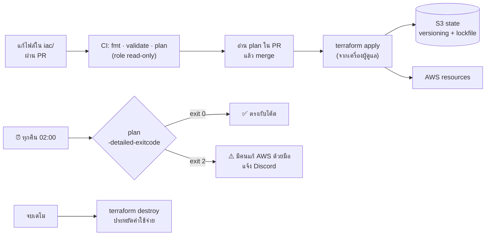

# Infrastructure as Code (Terraform)

Terraform รับผิดชอบแค่ infrastructure ไม่แตะ application deployment เลย — ส่วนนั้นเป็นหน้าที่ของ Argo CD (ดู [cicd-pipeline.md](cicd-pipeline.md))

Infrastructure สร้างใหม่ซ้ำได้จาก code ทั้งหมด และ `terraform destroy` ได้หลังเดโมเพื่อคุมค่าใช้จ่าย (ดู [cost.md](cost.md))

## ทรัพยากรที่ Terraform สร้าง

| ไฟล์ | สร้างอะไร |
| --- | --- |
| `versions.tf` | provider, remote state บน S3 (`use_lockfile`) |
| `network.tf` | VPC, public subnet, Internet Gateway, route table |
| `security_group.tf` | เปิด 80/443 ทุกที่, 6443 เฉพาะ `var.admin_cidr` |
| `iam.tf` | IAM role และ instance profile แบบ least privilege + SSM |
| `ec2.tf` | EC2 t3a.large, Elastic IP, IMDSv2, EBS เข้ารหัส, user_data ติดตั้ง K3s |
| `ecr.tf` | ECR 2 repo, IMMUTABLE, scan on push, lifecycle เก็บ 10 image ล่าสุด |
| `s3.tf` | bucket ไฟล์ผู้ใช้, block public access, SSE, lifecycle 1 วัน |
| `outputs.tf` | public IP, ชื่อ bucket, ECR URL |

สิ่งที่แต่ละไฟล์ต้องมีอยู่ใน [build-checklist.md — Phase 1](build-checklist.md#phase-1--terraform)

## เหตุผลที่ต้องสร้าง state bucket ด้วยมือ

Terraform ต้องมีที่เก็บ state ก่อนจะเริ่มทำงานได้ จึงใช้ Terraform สร้าง bucket นี้เองไม่ได้ (ปัญหาไก่กับไข่) ต้องสร้าง S3 bucket แล้วเปิด versioning ด้วยมือครั้งเดียวก่อนรัน `terraform init` ครั้งแรก
